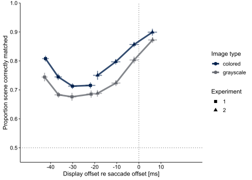
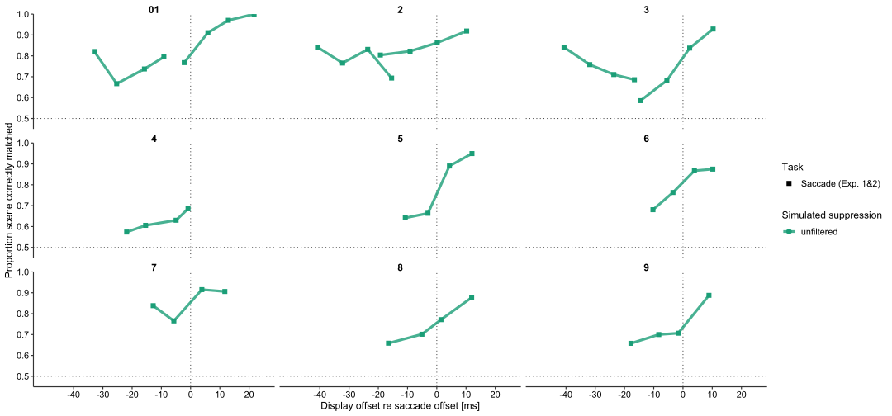
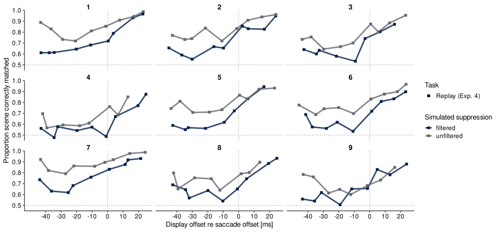
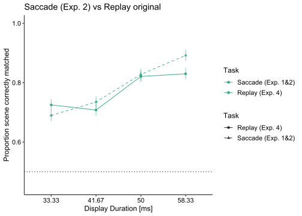
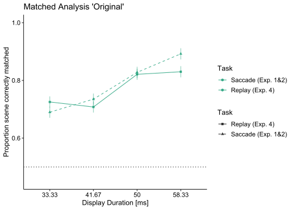
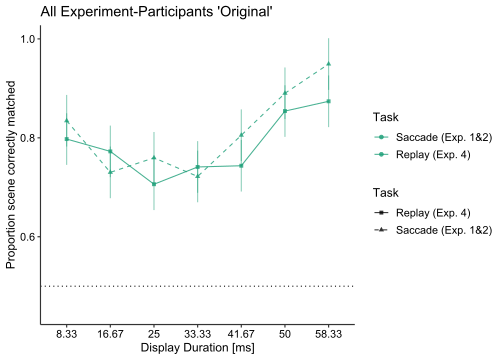
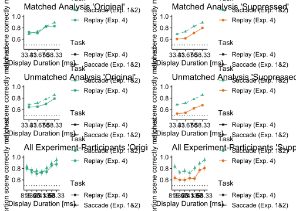

ISSPR
================
Mara Doering
2024-02-06

``` r
output_form <- 'svg'
knitr::opts_chunk$set(dev = output_form) # set output device to svg or pdf
```

## The Data

In this chunk we’ll load the data.

``` r
load("ISSPR_final_cleaned_data_new.rda")
str(ISSPR_data_without_overlap_metrics)
```

    ## Classes 'data.table' and 'data.frame':   31517 obs. of  93 variables:
    ##  $ replay_ID                      : chr  "1_02_10_12_1" "1_02_10_12_1" "1_02_10_14_1" "1_02_10_14_1" ...
    ##  $ ID                             : Factor w/ 33204 levels "4_08_10_1002_1",..: 24455 24689 6908 7167 14015 15002 6546 6570 21632 22479 ...
    ##  $ subj_id.x                      : chr  "P3" "P3" "15" "15" ...
    ##  $ n_overlap_first                : num  0 0 0 0 0 0 0 0 0 0 ...
    ##  $ n_overlap_second               : num  0 0 0 0 0 0 0 0 0 0 ...
    ##  $ post_scene_nr                  : num  82 82 43 43 71 71 62 62 76 76 ...
    ##  $ intra_scene_nr                 : num  58 82 20 43 3 71 90 62 82 76 ...
    ##  $ session_name                   : chr  "P320" "P320" "1510" "1510" ...
    ##  $ subj_id.y                      : chr  "P3" "P3" "15" "15" ...
    ##  $ session_id                     : chr  "20" "20" "10" "10" ...
    ##  $ subj_dominant_eye              : num  1 1 1 1 1 1 1 1 1 1 ...
    ##  $ scr_ppd                        : num  20.6 20.6 20.6 20.6 20.6 ...
    ##  $ trial                          : num  315 478 629 275 523 561 480 129 446 701 ...
    ##  $ trial_id                       : num  18 63 21 66 906 ...
    ##  $ nr_iteration                   : num  1 1 1 1 1 1 1 1 1 1 ...
    ##  $ block                          : num  4 6 7 4 6 7 6 2 5 8 ...
    ##  $ start_left                     : logi  TRUE TRUE TRUE TRUE TRUE TRUE ...
    ##  $ start_pos_x                    : num  459 480 480 501 501 ...
    ##  $ start_pos_y                    : num  291 249 249 249 291 ...
    ##  $ end_pos_x                      : num  459 480 480 501 501 ...
    ##  $ end_pos_y                      : num  291 249 249 249 291 ...
    ##  $ sac_suppression                : num  0 0 0 0 1 1 1 1 1 1 ...
    ##  $ stim_dur                       : num  8.33 8.33 8.33 8.33 16.67 ...
    ##  $ stim_frames                    : num  12 12 12 12 24 24 36 36 36 36 ...
    ##  $ color_yes                      : num  0 0 0 0 0 0 0 0 0 0 ...
    ##  $ same_pic                       : num  0 1 0 1 0 1 0 1 0 1 ...
    ##  $ stim_set_nr                    : num  1 1 1 1 2 2 3 3 3 3 ...
    ##  $ stim_set_path                  : chr  "StereoThumb_select_11" "StereoThumb_select_11" "StereoThumb_select_15" "StereoThumb_select_15" ...
    ##  $ intra_filename                 : chr  "syns_58.jpg" "syns_82.jpg" "syns_20.jpg" "syns_43.jpg" ...
    ##  $ post_filename                  : chr  "syns_82.jpg" "syns_82.jpg" "syns_43.jpg" "syns_43.jpg" ...
    ##  $ replay_stim_dur                : num  8.33 8.33 8.33 8.33 16.67 ...
    ##  $ replay_intended_stim_dur_offset: num  0 0 0 0 0 0 0 0 0 0 ...
    ##  $ replay_sac_display_latency     : num  9 9 9 9 8 8 6 6 9 9 ...
    ##  $ replay_sac_display_off_latency : num  -54.7 -54.7 -32.7 -32.7 -43.3 ...
    ##  $ replay_sac_dur                 : num  72 72 50 50 68 68 52 52 80 80 ...
    ##  $ replay_sac_dur_Full            : num  96 96 74 74 90 90 76 76 86 86 ...
    ##  $ replay_sac_latency             : num  164 164 114 114 109 109 136 136 234 234 ...
    ##  $ dropped                        : num  0 0 0 0 0 0 0 0 0 0 ...
    ##  $ t_fixStart                     : num  1.69e+12 1.69e+12 1.70e+12 1.70e+12 1.70e+12 ...
    ##  $ t_fixEnd                       : num  1.69e+12 1.69e+12 1.70e+12 1.70e+12 1.70e+12 ...
    ##  $ t_cueOn                        : num  1.69e+12 1.69e+12 1.70e+12 1.70e+12 1.70e+12 ...
    ##  $ t_move_started                 : num  1.69e+12 1.69e+12 1.70e+12 1.70e+12 1.70e+12 ...
    ##  $ t_move_finished                : num  1.69e+12 1.69e+12 1.70e+12 1.70e+12 1.70e+12 ...
    ##  $ t_saccading                    : num  1.69e+12 1.69e+12 1.70e+12 1.70e+12 1.70e+12 ...
    ##  $ t_first_scene_on               : num  1.69e+12 1.69e+12 1.70e+12 1.70e+12 1.70e+12 ...
    ##  $ t_first_scene_off              : num  1.69e+12 1.69e+12 1.70e+12 1.70e+12 1.70e+12 ...
    ##  $ t_second_scene_on              : num  1.69e+12 1.69e+12 1.70e+12 1.70e+12 1.70e+12 ...
    ##  $ t_second_scene_off             : num  1.69e+12 1.69e+12 1.70e+12 1.70e+12 1.70e+12 ...
    ##  $ t_boundary_cross               : num  NaN NaN NaN NaN NaN NaN NaN NaN NaN NaN ...
    ##  $ t_responded                    : num  1.69e+12 1.69e+12 1.70e+12 1.70e+12 1.70e+12 ...
    ##  $ resp                           : num  0 1 0 1 1 1 0 0 0 0 ...
    ##  $ response_too_early             : logi  FALSE FALSE FALSE FALSE FALSE FALSE ...
    ##  $ wrong_key                      : logi  FALSE FALSE FALSE FALSE FALSE FALSE ...
    ##  $ fixationPassed                 : logi  TRUE TRUE TRUE TRUE TRUE TRUE ...
    ##  $ fixBrokenCntr                  : num  0 0 0 0 0 8 0 14 1 1 ...
    ##  $ subj_dominant_eye.1            : num  1 1 1 1 1 1 1 1 1 1 ...
    ##  $ EVENT_cueOn                    : num  1265699 2461519 6667077 5175382 11645826 ...
    ##  $ EVENT_timeMoveStarted          : num  1265707 2461527 6667086 5175390 11645835 ...
    ##  $ EVENT_timeMoveFinished         : num  1265981 2461801 6667309 5175614 11646052 ...
    ##  $ EVENT_timeSaccade              : num  1265872 2461692 6667200 5175504 11645943 ...
    ##  $ EVENT_timeFirstSceneOn         : num  1265880 2461700 6667208 5175513 11645951 ...
    ##  $ EVENT_timeFirstSceneOff        : num  1265888 2461709 6667217 5175521 11645968 ...
    ##  $ EVENT_timeSecondSceneOn        : num  1266391 2462211 6667719 5176023 11646468 ...
    ##  $ EVENT_timeSecondSceneOff       : num  1266399 2462220 6667727 5176032 11646485 ...
    ##  $ EVENT_boundaryCross            : num  NA NA NA NA NA NA NA NA NA NA ...
    ##  $ eyelink_start_time             : num  1265137 2460858 6666591 5174870 11645090 ...
    ##  $ pc_start_time                  : num  1.69e+12 1.69e+12 1.70e+12 1.70e+12 1.70e+12 ...
    ##  $ time_intercept                 : num  -1.193 -0.531 -0.479 -0.664 -0.576 ...
    ##  $ time_slope                     : num  1 1 1 1 1 ...
    ##  $ EVENT_cueOn_pc                 : num  1.69e+12 1.69e+12 1.70e+12 1.70e+12 1.70e+12 ...
    ##  $ EVENT_timeMoveStarted_pc       : num  1.69e+12 1.69e+12 1.70e+12 1.70e+12 1.70e+12 ...
    ##  $ EVENT_timeMoveFinished_pc      : num  1.69e+12 1.69e+12 1.70e+12 1.70e+12 1.70e+12 ...
    ##  $ EVENT_timeSaccade_pc           : num  1.69e+12 1.69e+12 1.70e+12 1.70e+12 1.70e+12 ...
    ##  $ EVENT_timeFirstSceneOn_pc      : num  1.69e+12 1.69e+12 1.70e+12 1.70e+12 1.70e+12 ...
    ##  $ EVENT_timeFirstSceneOff_pc     : num  1.69e+12 1.69e+12 1.70e+12 1.70e+12 1.70e+12 ...
    ##  $ EVENT_timeSecondSceneOn_pc     : num  1.69e+12 1.69e+12 1.70e+12 1.70e+12 1.70e+12 ...
    ##  $ EVENT_timeSecondSceneOff_pc    : num  1.69e+12 1.69e+12 1.70e+12 1.70e+12 1.70e+12 ...
    ##  $ EVENT_boundaryCross_pc         : num  NA NA NA NA NA NA NA NA NA NA ...
    ##  $ session_nr                     : chr  "2" "2" "1" "1" ...
    ##  $ rt                             : num  NA NA NA NA NA NA NA NA NA NA ...
    ##  $ start_left_f                   : Factor w/ 1 level "rightward saccade": 1 1 1 1 1 1 1 1 1 1 ...
    ##  $ same_pic_f                     : Factor w/ 2 levels "different","same": 1 2 1 2 1 2 1 2 1 2 ...
    ##  $ color_yes_f                    : Factor w/ 1 level "grayscale": 1 1 1 1 1 1 1 1 1 1 ...
    ##  $ sac_suppression_f              : Factor w/ 2 levels "original","suppressed": 1 1 1 1 2 2 2 2 2 2 ...
    ##  $ correct                        : num  1 1 1 1 0 1 1 0 1 0 ...
    ##  $ intra_category                 : chr  "Transport" "Indoor" "Natural environments" "Woodland" ...
    ##  $ intra_subcategory              : chr  "Rail and roads" "Offices" "Heath and moorland" "Deciduous woodland" ...
    ##  $ post_category                  : chr  "Indoor" "Indoor" "Woodland" "Woodland" ...
    ##  $ post_subcategory               : chr  "Offices" "Offices" "Deciduous woodland" "Deciduous woodland" ...
    ##  $ experiment                     : num  4 4 4 4 4 4 4 4 4 4 ...
    ##  $ sac_amp                        : num  18.6 18.6 11.6 11.6 18.3 ...
    ##  $ sac_dur                        : num  72 72 50 50 68 68 52 52 80 80 ...
    ##  $ vpeak                          : num  361 361 330 330 383 ...
    ##  - attr(*, ".internal.selfref")=<externalptr> 
    ##  - attr(*, "sorted")= chr "replay_ID"

``` r
# check completeness of sessions
table(ISSPR_data_without_overlap_metrics$subj_id.x, ISSPR_data_without_overlap_metrics$session_nr)
```

    ##     
    ##        1   2
    ##   08 774 792
    ##   11 803 802
    ##   12 806 777
    ##   13 781 782
    ##   15 802 809
    ##   16 790 795
    ##   17 741 782
    ##   18 781 793
    ##   19 782 789
    ##   20 789 797
    ##   21 803 800
    ##   22 786 793
    ##   P1 799 808
    ##   P2 803 804
    ##   P3 723 746
    ##   P4 792 803
    ##   P5 783 768
    ##   P6 795 805
    ##   P7 785 809
    ##   P9 769 776

Here we load the data from Experiment 1-3

``` r
#load("~/Masterarbeit/ISSPR R Studio/ISSP_cleaned_data (1).rda")
#View(issp)

# Richard: 
# To make sure that I and other people can run this script, it is important to only use file paths that are synced via Git. 
# In other words, you should put this file in the project directory, so that it can be pushed to Github. 
# Of course, the file 'ISSP_cleaned_data.rda' is huge (~1.4 GB), because it contains all the raw samples, and it should not be on Github. 
# That's why I made a file that contains only the data.table 'issp' (since that's what you're using anyway), that we load here:
load("ISSP_data.rda")
```

Here we will load the needed libraries

``` r
library(data.table)
library(ggplot2)
library(ez)
library(assertthat)
library(psych)
library(resample)
library(mlr)
library(gsignal)
library(plyr)
library(dplyr)
library(boot)
library(ggpubr)
library(ggiraph)
library(viridisLite)
library(viridis)
library(lme4)
library(lmerTest)
library(robust)
library(fit.models)
library(pracma)
library(mgcv)
library(robustbase)
library(quickpsy)
library(scales)
```

Some important basics before running main parts

``` r
# first we need this: http://stackoverflow.com/questions/10738729/r-strsplit-with-multiple-unordered-split-arguments
strsplits <- function(x, splits, ...)
{
  for (split in splits)
  {
    x <- unlist(strsplit(x, split, ...))
  }
  return(x[!x == ""]) # Remove empty values (it actually returns nonempty values - dose not remove anything)
}

bin_to_numeric <- function(input, splits_used = c("\\(", "\\)", "\\[", "\\]", ",") ) {
  # this function converts output from the cut_number/cut_width - function to numeric values
  return(mean(as.numeric(strsplits(x = as.character(input), splits = splits_used))))
}

ocimTheme <- function(base_size=15, base_family="Helvetica") { 
  theme_classic(base_size=base_size, base_family=base_family) %+replace% 
    theme(
      # size of text
      axis.text = element_text(size = 0.9*base_size),
      legend.text = element_text(size = 0.9*base_size),
      # remove grid horizontal and vertical lines
      panel.grid.major = element_blank(),
      panel.grid.minor = element_blank(),
      panel.background  = element_blank(),
      # panel boxes
      panel.border = element_blank(),
      axis.line = element_line(colour = "grey20"), 
      # facet strips
      strip.text = element_text(size = base_size, face = "bold"),
      strip.background = element_rect(fill="transparent", colour = "transparent"),
      strip.placement = "outside",
      # legend
      legend.background = element_rect(fill="transparent", colour=NA),
      legend.key = element_rect(fill="transparent", colour=NA)
    )
}


scr.ppd <- 20.5652

experiment_colorscale <- c('#1b9e77','#d95f02','#7570b3')
```

Preparing data file

``` r
setDT(ISSPR_data_without_overlap_metrics)
ISSPR_data_without_overlap_metrics <- ISSPR_data_without_overlap_metrics[!is.na(resp)]
issp[ , stim_dur_ms_f := ordered(stim_dur_ms)]
issp[ , experiment_f := factor(experiment)]
```

Stimulus Duration changes to numeric

``` r
ISSPR_data_without_overlap_metrics$stim_dur <- as.character(ISSPR_data_without_overlap_metrics$stim_dur)
ISSPR_data_without_overlap_metrics[ , stim_dur := as.numeric(as.character(stim_dur))]
ISSPR_data_without_overlap_metrics[ , stim_dur := ordered(round(stim_dur, 2))]
```

Here we start with the common_subj_id for Experiment 2 und Reply
Experiment

``` r
#first we will have the three P. which were tested for Experiment 1 and 2; Reply
issp[experiment==2 & subj_id=="10", common_subj_id := "1"]
issp[experiment==1 & subj_id=="20", common_subj_id := "1"]
ISSPR_data_without_overlap_metrics[subj_id.x=="2", common_subj_id := "1"]

issp[experiment==2 & subj_id=="20", common_subj_id := "2"]
issp[experiment==1 & subj_id=="19", common_subj_id := "2"]
ISSPR_data_without_overlap_metrics[subj_id.x=="3", common_subj_id := "2"]

issp[experiment==2 & subj_id=="15", common_subj_id := "3"]
issp[experiment==1 & subj_id=="23", common_subj_id := "3"]
ISSPR_data_without_overlap_metrics[subj_id.x=="7", common_subj_id := "3"]

# here we create only for P. which were included for Experiment 2 and Reply
issp[experiment==2 & subj_id=="3", common_subj_id := "4"]
ISSPR_data_without_overlap_metrics[subj_id.x=="5", common_subj_id := "4"]

issp[experiment==2 & subj_id=="1", common_subj_id := "5"]
ISSPR_data_without_overlap_metrics[subj_id.x=="1", common_subj_id := "5"]

issp[experiment==2 & subj_id=="11", common_subj_id := "6"]
ISSPR_data_without_overlap_metrics[subj_id.x=="4", common_subj_id := "6"]

issp[experiment==2 & subj_id=="12", common_subj_id := "7"]
ISSPR_data_without_overlap_metrics[subj_id.x=="9", common_subj_id := "7"]

issp[experiment==2 & subj_id=="16", common_subj_id := "8"]
ISSPR_data_without_overlap_metrics[subj_id.x=="20", common_subj_id := "8"]

issp[experiment==2 & subj_id=="14", common_subj_id := "9"]
ISSPR_data_without_overlap_metrics[subj_id.x=="8", common_subj_id := "9"]
```

View(issp)

Here we create one plot for Exp. 1&2 and color condition (Example)

``` r
figure2_xlim_issp12 <- c(-50, 25)

issp12_color_correct <- issp[experiment<3,# & sac_dur_prob>=0.4 & sac_dur_prob<=0.6, 
                             .(correct = mean(correct), 
                               sac_display_off_latency = mean(sac_display_off_latency)), 
                             by = .(experiment_f, subj_id, color_yes_f, stim_dur_ms)]

issp12_color_correct[ , stim_dur_ms_f := ordered(stim_dur_ms)]
issp12_color_correct[ , gm_correct := mean(correct), by = .(experiment_f)]
issp12_color_correct[ , correct.w := correct - mean(correct) + gm_correct, by = .(experiment_f, subj_id)]
issp12_color_correct_agg <- issp12_color_correct[ , 
                                                  .(correct = mean(correct.w), 
                                                    correct_se = sd(correct.w) / sqrt(length(correct.w)), 
                                                    sac_display_off_latency = mean(sac_display_off_latency), 
                                                    sac_display_off_latency_sd = sd(sac_display_off_latency) / sqrt(length(sac_display_off_latency)) ), 
                                                  by = .(experiment_f, color_yes_f, stim_dur_ms)]
# plot the time course for the different scenes
p_issp12_color <- ggplot(data = issp12_color_correct_agg, 
                         aes(x = sac_display_off_latency, y = correct, color = color_yes_f, 
                             shape = experiment_f, 
                             group = paste(experiment_f, color_yes_f))) + 
  geom_vline(xintercept = 0, linetype = "dotted", alpha = 0.7) + 
  geom_hline(yintercept = 0.5, linetype = "dotted", alpha = 0.7) + 
  geom_errorbar(aes(ymax = correct + correct_se, ymin = correct - correct_se), 
                width = 0, size = 1, alpha = 0.5) + 
  geom_errorbarh(aes(xmax = sac_display_off_latency + sac_display_off_latency_sd, 
                     xmin = sac_display_off_latency - sac_display_off_latency_sd), 
                 height = 0, size = 1, alpha = 0.5) + 
  geom_line(size = 1.5, alpha = 0.8) + 
  geom_point(size = 2.5) + 
  theme_classic(base_size = 12.5) + ocimTheme() + 
  coord_cartesian(ylim = c(0.45, 1)) + 
  scale_color_viridis_d(option = "cividis", end = 0.4, direction = -1, guide = guide_legend(reverse = TRUE)) +
  scale_shape_manual(values = c(15, 17)) + 
  scale_y_continuous(expand = c(0,0)) + 
  scale_x_continuous(breaks = c(-40, -30, -20, -10, 0, 10), limits = figure2_xlim_issp12) + 
  labs(x = "Display offset re saccade offset [ms]", y = "Proportion scene correctly matched", 
       color = "Image type", fill = "Image type", shape = "Experiment")
```

    ## Warning: Using `size` aesthetic for lines was deprecated in ggplot2 3.4.0.
    ## ℹ Please use `linewidth` instead.
    ## This warning is displayed once every 8 hours.
    ## Call `lifecycle::last_lifecycle_warnings()` to see where this warning was
    ## generated.

``` r
p_issp12_color
```

<!-- -->

Here we start with the Prop. Correct for ISSP 1&2; by common_subj_id

``` r
issp12_prop_correct <- issp[experiment<3, 
                             .(correct = mean(correct), 
                               sac_display_off_latency = mean(sac_display_off_latency)), 
                             by = .(experiment_f, subj_id, common_subj_id, color_yes_f, stim_dur_ms)]

issp12_prop_correct[ , stim_dur_ms_f := ordered(stim_dur_ms)]
issp12_prop_correct[ , gm_correct := mean(correct), by = .(experiment_f)]
issp12_prop_correct[ , correct.w := correct - mean(correct) + gm_correct, by = .(experiment_f, common_subj_id)]
# issp12_prop_correct [, color_yes_f=="grayscale"]
# Richard: this command above does nothing but tell you whether the column color_yes_f is grayscale. 
# As you can see the output is just a vector of TRUE and FALSE. 
# What you want instead is a subset of only those values where color_yes_f is grayscale. This is done here:
issp12_prop_correct <- issp12_prop_correct[color_yes_f=="grayscale"]
issp12_prop_correct[ , sac_suppression_f:= factor("unfiltered")]
issp12_prop_correct[ , fixreplay:= ("Saccade (Exp. 1&2)")]
# if you check this, you find that all other subjects are also still included as NA:
table(issp12_prop_correct$common_subj_id, issp12_prop_correct$experiment_f, useNA="ifany")
```

    ##       
    ##         1  2  3
    ##   1     4  4  0
    ##   2     4  4  0
    ##   3     4  4  0
    ##   6     0  4  0
    ##   7     0  4  0
    ##   8     0  4  0
    ##   9     0  4  0
    ##   <NA> 68 52  0

``` r
issp12_prop_correct[is.na(common_subj_id), common_subj_id := "all others"]
# in this variable we code whether participants have a common_subj_id or not
issp12_prop_correct[common_subj_id == "all others", common_subj_id_exists := "unmatched"]
issp12_prop_correct[common_subj_id != "all others", common_subj_id_exists := "matched"]

# this has to be a population aggregate. Including common_subj_id aggregates for each subject (which is already aggregated)
issp12_prop_correct_agg <- issp12_prop_correct[ , 
                                                  .(correct = mean(correct.w), 
                                                    correct_se = sd(correct.w) / sqrt(length(correct.w)), 
                                                    sac_display_off_latency = mean(sac_display_off_latency), 
                                                    sac_display_off_latency_sd = sd(sac_display_off_latency) / sqrt(length(sac_display_off_latency)) ), 
                                                  by = .(common_subj_id_exists, 
                                                         experiment_f, color_yes_f, stim_dur_ms, fixreplay, sac_suppression_f)]
```

Here we create the Plot for Prop. Correct; ISSP 1&2 and Common_subj_id

Richard: Note the command to determine figure width and height in
markdown.

``` r
# this is for individual subjects, only those that have a common_subj_id:
p_issp12_prop_subj <- ggplot(data = issp12_prop_correct[common_subj_id != "all others"], 
                         aes(x = sac_display_off_latency, y = correct, color = sac_suppression_f, 
                             shape = fixreplay, 
                             group = paste(experiment_f, color_yes_f)))+ 
  geom_vline(xintercept = 0, linetype = "dotted", alpha = 0.7) + 
  geom_hline(yintercept = 0.5, linetype = "dotted", alpha = 0.7) + 
  geom_line(size = 1.5, alpha = 0.8) + 
  geom_point(size = 2.5) + 
  theme_classic(base_size = 12.5) + ocimTheme() + 
  coord_cartesian(ylim = c(0.45, 1)) + 
  scale_color_viridis_d(option = "cividis", end = 0.4, direction = -1, guide = guide_legend(reverse = TRUE)) +
  scale_shape_manual(values = c(15, 17)) + 
  scale_y_continuous(expand = c(0,0)) + 
  scale_x_continuous(breaks = c(-40, -30, -20, -10, 0, 10, 20), limits = figure2_xlim_issp12) + 
  labs(x = "Display offset re saccade offset [ms]", y = "Proportion scene correctly matched", 
       color = "Simulated suppression", fill = "Simulated suppression", shape = "Task") + 
  # Richard: I have added the facet_wrap below to allow a view at individual subjects
  facet_wrap(~common_subj_id) 
p_issp12_prop_subj
```

<!-- -->

``` r
# this plot contains the population aggregate for participants that are matched across experiments
# (common_subj_ids 1..9) and those that are not (encoded in the variable common_subj_id_exists)
p_issp12_prop <- ggplot(data = issp12_prop_correct_agg, 
                         aes(x = sac_display_off_latency, y = correct, color = sac_suppression_f, 
                             shape = fixreplay, 
                             group = paste(experiment_f, color_yes_f)))+ 
  geom_vline(xintercept = 0, linetype = "dotted", alpha = 0.7) + 
  geom_hline(yintercept = 0.5, linetype = "dotted", alpha = 0.7) + 
  geom_errorbar(aes(ymax = correct + correct_se, ymin = correct - correct_se), 
                width = 0, size = 1, alpha = 0.5) + 
  geom_errorbarh(aes(xmax = sac_display_off_latency + sac_display_off_latency_sd, 
                     xmin = sac_display_off_latency - sac_display_off_latency_sd), 
                 height = 0, size = 1, alpha = 0.5) + 
  geom_line(size = 1.5, alpha = 0.8) + 
  geom_point(size = 2.5) + 
  theme_classic(base_size = 12.5) + ocimTheme() + 
  coord_cartesian(ylim = c(0.45, 1)) + 
  scale_color_viridis_d(option = "cividis", end = 0.4, direction = -1, guide = guide_legend(reverse = TRUE)) +
  scale_shape_manual(values = c(15, 17)) + 
  scale_y_continuous(expand = c(0,0)) + 
  scale_x_continuous(breaks = c(-40, -30, -20, -10, 0, 10, 20), limits = figure2_xlim_issp12) + 
  labs(x = "Display offset re saccade offset [ms]", y = "Proportion scene correctly matched", 
       color = "Simulated suppression", fill = "Simulated suppression", shape = "Task") + 
  facet_wrap(~common_subj_id_exists)
p_issp12_prop
```

<!-- -->

MARA, you CONTINUE FROM HERE making a plot that does the same for the
Replay Experiment (for unfiltered vs suppression)…

``` r
ISSPR_prop_correct <- ISSPR_data_without_overlap_metrics[experiment==4, 
                             .(correct = mean(correct), 
                               replay_sac_display_off_latency = mean(replay_sac_display_off_latency)), 
                             by = .(experiment, common_subj_id, color_yes_f, stim_dur)] # Richard: color_yes is not useful here

ISSPR_prop_correct[ , stim_dur := ordered(stim_dur)]
ISSPR_prop_correct[ , gm_correct := mean(correct), by = .(experiment)]
ISSPR_prop_correct[ , correct.w := correct - mean(correct) + gm_correct, by = .(experiment, common_subj_id)]
ISSPR_prop_correct [, color_yes_f=="grayscale"]
```

    ##  [1] TRUE TRUE TRUE TRUE TRUE TRUE TRUE TRUE TRUE TRUE TRUE TRUE TRUE TRUE TRUE
    ## [16] TRUE TRUE TRUE

``` r
ISSPR_prop_correct[ , sac_suppression_f:= factor ("filtered")]
ISSPR_prop_correct[, fixreplay:= ("Replay (Exp. 4)")]

ISSPR_prop_correct_agg <- ISSPR_prop_correct[ , 
                                                  .(correct = mean(correct.w), 
                                                    correct_se = sd(correct.w) / sqrt(length(correct.w)), 
                                                    replay_sac_display_off_latency = mean(replay_sac_display_off_latency), 
                                                    replay_sac_display_off_latency_sd = sd(replay_sac_display_off_latency) / sqrt(length(replay_sac_display_off_latency)) ), 
                                                  by = .(common_subj_id,experiment, color_yes_f, stim_dur, fixreplay, sac_suppression_f)]
```

Here we create the Plot for Prop. Correct; ISSP Replay and
Common_subj_id

``` r
p_ISSPR_prop <- ggplot(data = ISSPR_prop_correct_agg, 
                         aes(x = replay_sac_display_off_latency, y = correct, color = sac_suppression_f, 
                             shape = fixreplay, 
                             group = paste(experiment, color_yes_f)))+ 
  geom_vline(xintercept = 0, linetype = "dotted", alpha = 0.7) + 
  geom_hline(yintercept = 0.5, linetype = "dotted", alpha = 0.7) + 
  geom_errorbar(aes(ymax = correct + correct_se, ymin = correct - correct_se), 
                width = 0, size = 1, alpha = 0.5) + 
  geom_errorbarh(aes(xmax = replay_sac_display_off_latency + replay_sac_display_off_latency_sd, 
                     xmin = replay_sac_display_off_latency - replay_sac_display_off_latency_sd), 
                 height = 0, size = 1, alpha = 0.5) + 
  geom_line(size = 1.5, alpha = 0.8) + 
  geom_point(size = 2.5) + 
  theme_classic(base_size = 12.5) + ocimTheme() + 
  coord_cartesian(ylim = c(0.45, 1)) + 
  scale_color_viridis_d(option = "cividis", end = 0.4, direction = -1, guide = guide_legend(reverse = TRUE)) +
  scale_shape_manual(values = c(15, 17)) + 
  scale_y_continuous(expand = c(0,0)) + 
  scale_x_continuous(breaks = c(-40, -30, -20, -10, 0, 10), limits = figure2_xlim_issp12) + 
  labs(x = "Display offset re saccade offset [ms]", y = "Proportion scene correctly matched", 
       color = "Simulated suppression", fill = "Simulated suppression", shape = "Task")
p_ISSPR_prop
```

    ## Warning: Removed 18 rows containing missing values or values outside the scale range
    ## (`geom_errorbarh()`).

<!-- -->

Preparing for “proportion correct” by subject

``` r
ISSPR_data_without_overlap_metrics[ , .(prop_correct = mean(correct)), 
  by = .(subj_id.x)]
```

    ##     subj_id.x prop_correct
    ##        <char>        <num>
    ##  1:        P3    0.7760381
    ##  2:        15    0.6921167
    ##  3:        19    0.6021642
    ##  4:        P2    0.7915370
    ##  5:        16    0.6138801
    ##  6:        P1    0.7554449
    ##  7:        P7    0.7402760
    ##  8:        08    0.7024266
    ##  9:        11    0.7482866
    ## 10:        12    0.6285534
    ## 11:        17    0.6178595
    ## 12:        21    0.7498440
    ## 13:        22    0.7796073
    ## 14:        P6    0.7068750
    ## 15:        13    0.6641075
    ## 16:        18    0.6264295
    ## 17:        20    0.7351828
    ## 18:        P5    0.6557060
    ## 19:        P4    0.7485893
    ## 20:        P9    0.8330097
    ##     subj_id.x prop_correct

``` r
prop_correct_subj_replay <- ISSPR_data_without_overlap_metrics[ , .(prop_correct = mean(correct)), by = .(subj_id.x, sac_suppression_f, stim_dur)][order(subj_id.x, sac_suppression_f, stim_dur)]
```

Plot for proportion correct by image type and subject

``` r
p_prop_correct_subj_replay <- ggplot(data = prop_correct_subj_replay, 
                              aes(x = stim_dur, y = prop_correct, 
                                  color = sac_suppression_f, group = sac_suppression_f)) + 
  geom_point() + geom_line() + geom_hline(yintercept = 0.5,linetype='dashed')+
  theme_classic() + 
  labs(x = "Presentation duration [ms]", y = "Proportion correct", 
       color = "Image type") + 
  facet_wrap(~subj_id.x)

p_prop_correct_subj_replay
```

<!-- -->

Here we will run the ezANOVA 1 for proportion correct

``` r
#important here (factors)
prop_correct_subj_replay$stim_dur <- factor(prop_correct_subj_replay$stim_dur)
prop_correct_subj_replay$subj_id.x <- factor(prop_correct_subj_replay$subj_id.x) 

anov_prop_replay <- ezANOVA(data = prop_correct_subj_replay, dv =.(prop_correct), wid = .(subj_id.x),
                     within=.(sac_suppression_f,stim_dur), 
                     detailed = TRUE)

anov_prop_replay
```

    ## $ANOVA
    ##                       Effect DFn DFd         SSn        SSd           F
    ## 1                (Intercept)   1  19 180.7917129 1.58503451 2167.172084
    ## 2          sac_suppression_f   1  19   0.8289774 0.04440154  354.730315
    ## 3                   stim_dur   8 152   3.8049928 0.33523020  215.657374
    ## 4 sac_suppression_f:stim_dur   8 152   0.1103492 0.29944261    7.001793
    ##              p p<.05        ges
    ## 1 4.783257e-21     * 0.98763159
    ## 2 9.460959e-14     * 0.26800979
    ## 3 6.634634e-79     * 0.62694498
    ## 4 7.591503e-08     * 0.04647343
    ## 
    ## $`Mauchly's Test for Sphericity`
    ##                       Effect          W         p p<.05
    ## 3                   stim_dur 0.11921370 0.5253277      
    ## 4 sac_suppression_f:stim_dur 0.09629587 0.3685611      
    ## 
    ## $`Sphericity Corrections`
    ##                       Effect       GGe        p[GG] p[GG]<.05       HFe
    ## 3                   stim_dur 0.6884591 4.399222e-55         * 1.0019904
    ## 4 sac_suppression_f:stim_dur 0.6696791 7.065409e-06         * 0.9634243
    ##          p[HF] p[HF]<.05
    ## 3 6.634634e-79         *
    ## 4 1.250851e-07         *

Moreys Correction for proportion correct

``` r
# Removing in-between Variance
prop_correct_subj_replay[, ID_mean := mean(prop_correct), by =.(subj_id.x)] 
prop_correct_subj_replay[, overall_mean := mean(prop_correct),] 
prop_correct_subj_replay[, p_mean := (prop_correct - ID_mean + overall_mean),] 


p_correct_replay <- prop_correct_subj_replay[,
                               .(P_mean = mean(prop_correct), CP_mean = mean(p_mean),  C_SD = sd(p_mean), 
                                 C_SE = (sd(p_mean)/sqrt(length(p_mean))), N = length(p_mean)),
                               keyby= .(sac_suppression_f, stim_dur)]


## Standardfehler und Abweichung
prop_correct_subj_replay[, prop_SE := (sd(prop_correct)/sqrt(length(prop_correct))), by =.(subj_id.x, sac_suppression_f)]
prop_correct_subj_replay[, prop_SD := sd(prop_correct), by =.(subj_id.x, sac_suppression_f)]


n_conditions <- length(unique(p_correct_replay$sac_suppression_f))*length(unique(p_correct_replay$stim_dur))
p_correct_replay[, MC_se := C_SE*(n_conditions/(n_conditions-1))]
```

Second plot proportion correct

``` r
# erst character und dann numerischen Teil 
# hier wieder die presentation duration runden auf 2 Nachkommast.
prop_replay_plot <- ggplot(data = p_correct_replay, aes(x = stim_dur, y = P_mean, 
                                               color = sac_suppression_f, group = sac_suppression_f)) + 
  geom_hline(yintercept = 0.5,linetype='dashed')+
  geom_line(size = 1.5, alpha = 0.8) +
  geom_point(alpha = 0.8, size = 3) + 
  geom_ribbon(aes(ymin = P_mean - MC_se,
                  ymax = P_mean + MC_se), color = NA, alpha = 0.3) +
  scale_y_continuous(expand=c(0,0),limits=c(0.45,1))+
  scale_fill_viridis_d(option = "cividis", end = 0.4, direction = -1, guide = guide_legend(reverse = TRUE)) + 
  scale_color_viridis_d(option = "cividis", end = 0.4, direction = -1, guide = guide_legend(reverse = TRUE)) + 
  theme_classic(base_size = 15) + ocimTheme() +
  labs(x =  "Presentation duration [ms]",y = "Proportion correct", 
       fill = "Image type", color = "Image type") + 
  theme(legend.position = "right")

prop_replay_plot
```

<!-- -->

Here we will create BINS for the latency

``` r
ISSPR_data_without_overlap_metrics[, sac_display_off_latency_bins := cut_number(replay_sac_display_off_latency, n=6)]


prop_correct_subj_bins_replay <- ISSPR_data_without_overlap_metrics[ , .(prop_correct = mean(correct)), 
                                by = .(subj_id.x, sac_suppression_f, sac_display_off_latency_bins)][order(subj_id.x, sac_suppression_f, sac_display_off_latency_bins)]


prop_correct_subj_bins_replay$sac_suppression_f <- ordered(prop_correct_subj_bins_replay$sac_suppression_f)
```

Here we will create the Plot for BINS

``` r
p_prop_correct_subj_bins_replay <- ggplot(data = prop_correct_subj_bins_replay, 
                                   aes(x = sac_display_off_latency_bins, y = prop_correct, 
                                       color = sac_suppression_f, group = sac_suppression_f)) + 
  geom_point() + geom_line() + 
  theme_classic() + 
  labs(x = "Display offset re simulated saccade offset", y = "Proportion correct", 
       color = "Image type") + 
  facet_wrap(~subj_id.x)

p_prop_correct_subj_bins_replay
```

<!-- --> Here we
will have the ezANOVA 2 for the BINS

``` r
prop_correct_subj_bins_replay$subj_id.x <- factor(prop_correct_subj_bins_replay$subj_id.x)
anov_prop_bins_replay <- ezANOVA(data = prop_correct_subj_bins_replay, dv =prop_correct, wid = subj_id.x,
                          within=.(sac_suppression_f,sac_display_off_latency_bins), 
                          detailed = TRUE)

anov_prop_bins_replay
```

    ## $ANOVA
    ##                                           Effect DFn DFd          SSn
    ## 1                                    (Intercept)   1  19 120.39998441
    ## 2                              sac_suppression_f   1  19   0.57323830
    ## 3                   sac_display_off_latency_bins   5  95   3.05830985
    ## 4 sac_suppression_f:sac_display_off_latency_bins   5  95   0.04464465
    ##          SSd           F            p p<.05        ges
    ## 1 1.05124240 2176.091560 4.601696e-21     * 0.98864260
    ## 2 0.03297218  330.324759 1.800087e-13     * 0.29300998
    ## 3 0.15839722  366.849167 1.828410e-60     * 0.68858370
    ## 4 0.14052800    6.036152 6.791572e-05     * 0.03126848
    ## 
    ## $`Mauchly's Test for Sphericity`
    ##                                           Effect         W           p p<.05
    ## 3                   sac_display_off_latency_bins 0.1724916 0.008022343     *
    ## 4 sac_suppression_f:sac_display_off_latency_bins 0.4687397 0.534545132      
    ## 
    ## $`Sphericity Corrections`
    ##                                           Effect       GGe        p[GG]
    ## 3                   sac_display_off_latency_bins 0.6029378 2.165707e-37
    ## 4 sac_suppression_f:sac_display_off_latency_bins 0.7608278 3.772756e-04
    ##   p[GG]<.05       HFe        p[HF] p[HF]<.05
    ## 3         * 0.7293418 9.659168e-45         *
    ## 4         * 0.9750389 8.114876e-05         *

Morey Korrektur incl Cousineau for BINS

``` r
prop_correct_subj_bins_replay[, ID_mean := mean(prop_correct), by =.(subj_id.x)] 
prop_correct_subj_bins_replay[, overall_mean := mean(prop_correct),] 
prop_correct_subj_bins_replay[, p_mean := (prop_correct - ID_mean + overall_mean),] 

p_correct_bins_replay <- prop_correct_subj_bins_replay[,
                                         .(P_mean = mean(prop_correct), CP_mean = mean(p_mean),  C_SD = sd(p_mean), 
                                           C_SE = (sd(p_mean)/sqrt(length(p_mean))), N = length(p_mean)),
                                         keyby= .(sac_suppression_f, sac_display_off_latency_bins)]


# SD und Abweichung 
prop_correct_subj_bins_replay[, prop_SE := (sd(prop_correct)/sqrt(length(prop_correct))), by =.(subj_id.x, sac_suppression_f)]
prop_correct_subj_bins_replay[, prop_SD := sd(prop_correct), by =.(subj_id.x, sac_suppression_f)]


n_conditions_bins <- length(unique(p_correct_bins_replay$sac_suppression_f))*length(unique(p_correct_bins_replay$sac_display_off_latency_bins))
p_correct_bins_replay[, MC_se := C_SE*(n_conditions_bins/(n_conditions_bins-1))]
```

Second Plot for BINS

``` r
prop_bins_replay <- ggplot(data = p_correct_bins_replay, 
                 aes(x = sac_display_off_latency_bins, 
                     y = P_mean, 
                     color = sac_suppression_f, fill = sac_suppression_f, group = sac_suppression_f)) + 
  
  geom_hline(yintercept = 0.5,linetype='dashed')+
  geom_line(size = 1.5, alpha = 0.8) +
  geom_point(alpha = 0.8, size = 3) + 
  geom_ribbon(aes(ymin = P_mean - MC_se,
                  ymax = P_mean + MC_se), color = NA, alpha = 0.3) +
  scale_y_continuous(expand=c(0,0),limits=c(0.45,1))+
  scale_fill_viridis_d(option = "cividis", end = 0.4, direction = -1, guide = guide_legend(reverse = TRUE)) + 
  scale_color_viridis_d(option = "cividis", end = 0.4, direction = -1, guide = guide_legend(reverse = TRUE)) + 
  theme_classic(base_size = 15) + ocimTheme() +
  labs(x = "Display offset re simulated saccade offset",y = "Proportion correct", 
       fill = "Image type", color = "Image type") + 
  theme(legend.position = "right")

prop_bins_replay
```

<!-- --> Here we
will run some other des. statistics

``` r
ezStats(data = ISSPR_data_without_overlap_metrics[experiment=="4"], 
        dv = .(replay_sac_display_latency), wid = .(subj_id.x), 
        within = .(stim_dur) )
```

    ## Warning: Converting "subj_id.x" to factor for ANOVA.

    ## Warning: Collapsing data to cell means. *IF* the requested effects are a subset
    ## of the full design, you must use the "within_full" argument, else results may
    ## be inaccurate.

    ##   stim_dur  N     Mean        SD      FLSD
    ## 1     8.33 20 8.845138 0.1726913 0.1168101
    ## 2    16.67 20 8.937816 0.1397880 0.1168101
    ## 3       25 20 8.869960 0.1663857 0.1168101
    ## 4    33.33 20 9.060644 0.2405516 0.1168101
    ## 5    41.67 20 9.321213 0.2206385 0.1168101
    ## 6       50 20 9.310555 0.1593640 0.1168101
    ## 7    58.33 20 9.252517 0.2083374 0.1168101
    ## 8    66.67 20 9.197438 0.2020838 0.1168101
    ## 9       75 20 9.277307 0.1485654 0.1168101

``` r
ezStats(data = ISSPR_data_without_overlap_metrics[experiment=="4"], 
        dv = .(replay_sac_dur), wid = .(subj_id.x), 
        within = .(stim_dur) )
```

    ## Warning: Converting "subj_id.x" to factor for ANOVA.

    ## Warning: Collapsing data to cell means. *IF* the requested effects are a subset
    ## of the full design, you must use the "within_full" argument, else results may
    ## be inaccurate.

    ##   stim_dur  N     Mean        SD      FLSD
    ## 1     8.33 20 59.94793 0.8543478 0.6507833
    ## 2    16.67 20 61.90245 0.7700641 0.6507833
    ## 3       25 20 63.83004 1.2932527 0.6507833
    ## 4    33.33 20 62.03077 1.0490223 0.6507833
    ## 5    41.67 20 61.88801 0.7538052 0.6507833
    ## 6       50 20 60.07350 1.2177499 0.6507833
    ## 7    58.33 20 61.18590 1.0949111 0.6507833
    ## 8    66.67 20 60.58549 1.0407147 0.6507833
    ## 9       75 20 59.89003 1.0427160 0.6507833

``` r
anov_replay_sac_dur <- ezANOVA(data = ISSPR_data_without_overlap_metrics[experiment=="4"], 
        dv = .(replay_sac_dur), wid = .(subj_id.x), 
        within = .(stim_dur), detailed = TRUE)
```

    ## Warning: Converting "subj_id.x" to factor for ANOVA.

    ## Warning: Collapsing data to cell means. *IF* the requested effects are a subset
    ## of the full design, you must use the "within_full" argument, else results may
    ## be inaccurate.

Here we will figure out the effect of suppression and the task

``` r
ISSPR_suppression_correct <- ISSPR_data_without_overlap_metrics[ , .(prop_correct = mean(correct),
                                               replay_sac_display_off_latency = mean(replay_sac_display_off_latency)), 
                            by = .(subj_id.x, sac_suppression_f, stim_dur)]


ISSPR_suppression_correct [ , stim_dur := ordered(stim_dur)]

#Morey Korrektur incl Cousineau für suppression and task
ISSPR_suppression_correct[, ID_mean := mean(prop_correct), by =.(subj_id.x)] 
ISSPR_suppression_correct[, overall_mean := mean(prop_correct),] 
ISSPR_suppression_correct[, p_mean := (prop_correct - ID_mean + overall_mean),] 

p_correct_suppression <- ISSPR_suppression_correct[,
                                                       .(P_mean = mean(prop_correct), CP_mean = mean(p_mean),  C_SD = sd(p_mean), 
                                                         C_SE = (sd(p_mean)/sqrt(length(p_mean))), N = length(p_mean)),
                                                       keyby= .(sac_suppression_f, replay_sac_display_off_latency)]


# SD und Abweichung 
ISSPR_suppression_correct[, prop_SE := (sd(prop_correct)/sqrt(length(prop_correct))), by =.(subj_id.x, sac_suppression_f)]
ISSPR_suppression_correct[, prop_SD := sd(prop_correct), by =.(subj_id.x, sac_suppression_f)]


n_conditions_supp <- length(unique(p_correct_suppression$sac_suppression_f))*length(unique(p_correct_suppression$replay_sac_display_off_latency))
p_correct_suppression[, MC_se := C_SE*(n_conditions_supp/(n_conditions_supp-1))]
```

Plot for the results of suppression and task condition

``` r
p_ISSPR_suppression <- ggplot(data = p_correct_suppression, 
                         aes(x = replay_sac_display_off_latency, y = P_mean, color = sac_suppression_f, group= sac_suppression_f)) + 
  geom_vline(xintercept = 0, linetype = "dotted", alpha = 0.7) + 
  geom_hline(yintercept = 0.5, linetype = "dotted", alpha = 0.7) + 
  geom_line(size = 1.5, alpha = 0.8) + 
  geom_point(size = 2.5) + 
  theme_classic(base_size = 12.5) + ocimTheme() + 
  coord_cartesian(ylim = c(0.45, 1)) + 
  scale_color_viridis_d(option = "cividis", end = 0.4, direction = -1, guide = guide_legend(reverse = TRUE)) + 
  scale_y_continuous(expand = c(0,0)) + 
  scale_x_continuous(breaks = c(-40, -30, -20, -10, 0, 10)) + 
  labs(x = "Display offset re saccade offset [ms]", y = "Proportion scene correctly matched", 
       color = "Image type", fill = "Image type")

p_ISSPR_suppression
```

<!-- -->

Here we will have two dimensions (saccade duration and saccade
amplitude) for each subject by mean

``` r
ISSPR_data_without_overlap_metrics[, sac_amp_n := cut_number(sac_amp, n=10)]
ISSPR_data_without_overlap_metrics[, sac_dur_bins := cut_number(sac_dur, n=2)]
table(ISSPR_data_without_overlap_metrics$subj_id.x, 
      ISSPR_data_without_overlap_metrics$sac_dur_bins)
```

    ##     
    ##      [22,60] (60,102]
    ##   08     792      774
    ##   11     809      796
    ##   12     800      783
    ##   13     789      774
    ##   15     790      821
    ##   16     793      792
    ##   17     775      748
    ##   18     797      777
    ##   19     792      779
    ##   20     803      783
    ##   21     845      758
    ##   22     808      771
    ##   P1     833      774
    ##   P2     815      792
    ##   P3     726      743
    ##   P4     837      758
    ##   P5     785      766
    ##   P6     815      785
    ##   P7     821      773
    ##   P9     773      772

``` r
metrics_subj_bins_replay_dur <- ISSPR_data_without_overlap_metrics[ , .(sac_dur_f = mean(sac_dur), 
                                                                        disp_off_re_sac_off = mean(replay_sac_display_off_latency), 
                                                                        correct = mean(correct)),
                                                                by = .(subj_id.x, sac_dur_bins, stim_dur)]
metrics_subj_bins_replay_dur[ , sac_dur_f2 := mean(sac_dur_f), by = .(subj_id.x, sac_dur_bins)]
```

Here is the plot of sac_dur and sac_amp

``` r
ggplot(data = metrics_subj_bins_replay_dur, 
       aes(x = disp_off_re_sac_off, 
           #x = as.numeric(stim_dur),
           y = correct,
           color = sac_dur_f, group = sac_dur_f2 )) + 
  geom_hline(yintercept = 0.5, linetype = "dotted") + 
  geom_vline(xintercept = 0, linetype = "dotted") + 
  geom_point() + geom_line() + 
  theme_classic() + 
  labs(x = "Display offset re saccade offset", y = "Proportion correct", 
       color = "Sacc. duration") + 
  facet_wrap(~subj_id.x)
```

<!-- -->
