ISSPR
================
Mara Doering
2024-02-06

``` r
output_form <- 'svg'
knitr::opts_chunk$set(dev = output_form) # set output device to svg or pdf
```

## The Data

In this chunk we’ll load the data.

``` r
load("ISSPR_final_cleaned_data_new.rda")
str(ISSPR_data_without_overlap_metrics)
```

    ## Classes 'data.table' and 'data.frame':   31517 obs. of  93 variables:
    ##  $ replay_ID                      : chr  "1_02_10_12_1" "1_02_10_12_1" "1_02_10_14_1" "1_02_10_14_1" ...
    ##  $ ID                             : Factor w/ 33204 levels "4_08_10_1002_1",..: 24455 24689 6908 7167 14015 15002 6546 6570 21632 22479 ...
    ##  $ subj_id.x                      : chr  "P3" "P3" "15" "15" ...
    ##  $ n_overlap_first                : num  0 0 0 0 0 0 0 0 0 0 ...
    ##  $ n_overlap_second               : num  0 0 0 0 0 0 0 0 0 0 ...
    ##  $ post_scene_nr                  : num  82 82 43 43 71 71 62 62 76 76 ...
    ##  $ intra_scene_nr                 : num  58 82 20 43 3 71 90 62 82 76 ...
    ##  $ session_name                   : chr  "P320" "P320" "1510" "1510" ...
    ##  $ subj_id.y                      : chr  "P3" "P3" "15" "15" ...
    ##  $ session_id                     : chr  "20" "20" "10" "10" ...
    ##  $ subj_dominant_eye              : num  1 1 1 1 1 1 1 1 1 1 ...
    ##  $ scr_ppd                        : num  20.6 20.6 20.6 20.6 20.6 ...
    ##  $ trial                          : num  315 478 629 275 523 561 480 129 446 701 ...
    ##  $ trial_id                       : num  18 63 21 66 906 ...
    ##  $ nr_iteration                   : num  1 1 1 1 1 1 1 1 1 1 ...
    ##  $ block                          : num  4 6 7 4 6 7 6 2 5 8 ...
    ##  $ start_left                     : logi  TRUE TRUE TRUE TRUE TRUE TRUE ...
    ##  $ start_pos_x                    : num  459 480 480 501 501 ...
    ##  $ start_pos_y                    : num  291 249 249 249 291 ...
    ##  $ end_pos_x                      : num  459 480 480 501 501 ...
    ##  $ end_pos_y                      : num  291 249 249 249 291 ...
    ##  $ sac_suppression                : num  0 0 0 0 1 1 1 1 1 1 ...
    ##  $ stim_dur                       : num  8.33 8.33 8.33 8.33 16.67 ...
    ##  $ stim_frames                    : num  12 12 12 12 24 24 36 36 36 36 ...
    ##  $ color_yes                      : num  0 0 0 0 0 0 0 0 0 0 ...
    ##  $ same_pic                       : num  0 1 0 1 0 1 0 1 0 1 ...
    ##  $ stim_set_nr                    : num  1 1 1 1 2 2 3 3 3 3 ...
    ##  $ stim_set_path                  : chr  "StereoThumb_select_11" "StereoThumb_select_11" "StereoThumb_select_15" "StereoThumb_select_15" ...
    ##  $ intra_filename                 : chr  "syns_58.jpg" "syns_82.jpg" "syns_20.jpg" "syns_43.jpg" ...
    ##  $ post_filename                  : chr  "syns_82.jpg" "syns_82.jpg" "syns_43.jpg" "syns_43.jpg" ...
    ##  $ replay_stim_dur                : num  8.33 8.33 8.33 8.33 16.67 ...
    ##  $ replay_intended_stim_dur_offset: num  0 0 0 0 0 0 0 0 0 0 ...
    ##  $ replay_sac_display_latency     : num  9 9 9 9 8 8 6 6 9 9 ...
    ##  $ replay_sac_display_off_latency : num  -54.7 -54.7 -32.7 -32.7 -43.3 ...
    ##  $ replay_sac_dur                 : num  72 72 50 50 68 68 52 52 80 80 ...
    ##  $ replay_sac_dur_Full            : num  96 96 74 74 90 90 76 76 86 86 ...
    ##  $ replay_sac_latency             : num  164 164 114 114 109 109 136 136 234 234 ...
    ##  $ dropped                        : num  0 0 0 0 0 0 0 0 0 0 ...
    ##  $ t_fixStart                     : num  1.69e+12 1.69e+12 1.70e+12 1.70e+12 1.70e+12 ...
    ##  $ t_fixEnd                       : num  1.69e+12 1.69e+12 1.70e+12 1.70e+12 1.70e+12 ...
    ##  $ t_cueOn                        : num  1.69e+12 1.69e+12 1.70e+12 1.70e+12 1.70e+12 ...
    ##  $ t_move_started                 : num  1.69e+12 1.69e+12 1.70e+12 1.70e+12 1.70e+12 ...
    ##  $ t_move_finished                : num  1.69e+12 1.69e+12 1.70e+12 1.70e+12 1.70e+12 ...
    ##  $ t_saccading                    : num  1.69e+12 1.69e+12 1.70e+12 1.70e+12 1.70e+12 ...
    ##  $ t_first_scene_on               : num  1.69e+12 1.69e+12 1.70e+12 1.70e+12 1.70e+12 ...
    ##  $ t_first_scene_off              : num  1.69e+12 1.69e+12 1.70e+12 1.70e+12 1.70e+12 ...
    ##  $ t_second_scene_on              : num  1.69e+12 1.69e+12 1.70e+12 1.70e+12 1.70e+12 ...
    ##  $ t_second_scene_off             : num  1.69e+12 1.69e+12 1.70e+12 1.70e+12 1.70e+12 ...
    ##  $ t_boundary_cross               : num  NaN NaN NaN NaN NaN NaN NaN NaN NaN NaN ...
    ##  $ t_responded                    : num  1.69e+12 1.69e+12 1.70e+12 1.70e+12 1.70e+12 ...
    ##  $ resp                           : num  0 1 0 1 1 1 0 0 0 0 ...
    ##  $ response_too_early             : logi  FALSE FALSE FALSE FALSE FALSE FALSE ...
    ##  $ wrong_key                      : logi  FALSE FALSE FALSE FALSE FALSE FALSE ...
    ##  $ fixationPassed                 : logi  TRUE TRUE TRUE TRUE TRUE TRUE ...
    ##  $ fixBrokenCntr                  : num  0 0 0 0 0 8 0 14 1 1 ...
    ##  $ subj_dominant_eye.1            : num  1 1 1 1 1 1 1 1 1 1 ...
    ##  $ EVENT_cueOn                    : num  1265699 2461519 6667077 5175382 11645826 ...
    ##  $ EVENT_timeMoveStarted          : num  1265707 2461527 6667086 5175390 11645835 ...
    ##  $ EVENT_timeMoveFinished         : num  1265981 2461801 6667309 5175614 11646052 ...
    ##  $ EVENT_timeSaccade              : num  1265872 2461692 6667200 5175504 11645943 ...
    ##  $ EVENT_timeFirstSceneOn         : num  1265880 2461700 6667208 5175513 11645951 ...
    ##  $ EVENT_timeFirstSceneOff        : num  1265888 2461709 6667217 5175521 11645968 ...
    ##  $ EVENT_timeSecondSceneOn        : num  1266391 2462211 6667719 5176023 11646468 ...
    ##  $ EVENT_timeSecondSceneOff       : num  1266399 2462220 6667727 5176032 11646485 ...
    ##  $ EVENT_boundaryCross            : num  NA NA NA NA NA NA NA NA NA NA ...
    ##  $ eyelink_start_time             : num  1265137 2460858 6666591 5174870 11645090 ...
    ##  $ pc_start_time                  : num  1.69e+12 1.69e+12 1.70e+12 1.70e+12 1.70e+12 ...
    ##  $ time_intercept                 : num  -1.193 -0.531 -0.479 -0.664 -0.576 ...
    ##  $ time_slope                     : num  1 1 1 1 1 ...
    ##  $ EVENT_cueOn_pc                 : num  1.69e+12 1.69e+12 1.70e+12 1.70e+12 1.70e+12 ...
    ##  $ EVENT_timeMoveStarted_pc       : num  1.69e+12 1.69e+12 1.70e+12 1.70e+12 1.70e+12 ...
    ##  $ EVENT_timeMoveFinished_pc      : num  1.69e+12 1.69e+12 1.70e+12 1.70e+12 1.70e+12 ...
    ##  $ EVENT_timeSaccade_pc           : num  1.69e+12 1.69e+12 1.70e+12 1.70e+12 1.70e+12 ...
    ##  $ EVENT_timeFirstSceneOn_pc      : num  1.69e+12 1.69e+12 1.70e+12 1.70e+12 1.70e+12 ...
    ##  $ EVENT_timeFirstSceneOff_pc     : num  1.69e+12 1.69e+12 1.70e+12 1.70e+12 1.70e+12 ...
    ##  $ EVENT_timeSecondSceneOn_pc     : num  1.69e+12 1.69e+12 1.70e+12 1.70e+12 1.70e+12 ...
    ##  $ EVENT_timeSecondSceneOff_pc    : num  1.69e+12 1.69e+12 1.70e+12 1.70e+12 1.70e+12 ...
    ##  $ EVENT_boundaryCross_pc         : num  NA NA NA NA NA NA NA NA NA NA ...
    ##  $ session_nr                     : chr  "2" "2" "1" "1" ...
    ##  $ rt                             : num  NA NA NA NA NA NA NA NA NA NA ...
    ##  $ start_left_f                   : Factor w/ 1 level "rightward saccade": 1 1 1 1 1 1 1 1 1 1 ...
    ##  $ same_pic_f                     : Factor w/ 2 levels "different","same": 1 2 1 2 1 2 1 2 1 2 ...
    ##  $ color_yes_f                    : Factor w/ 1 level "grayscale": 1 1 1 1 1 1 1 1 1 1 ...
    ##  $ sac_suppression_f              : Factor w/ 2 levels "original","suppressed": 1 1 1 1 2 2 2 2 2 2 ...
    ##  $ correct                        : num  1 1 1 1 0 1 1 0 1 0 ...
    ##  $ intra_category                 : chr  "Transport" "Indoor" "Natural environments" "Woodland" ...
    ##  $ intra_subcategory              : chr  "Rail and roads" "Offices" "Heath and moorland" "Deciduous woodland" ...
    ##  $ post_category                  : chr  "Indoor" "Indoor" "Woodland" "Woodland" ...
    ##  $ post_subcategory               : chr  "Offices" "Offices" "Deciduous woodland" "Deciduous woodland" ...
    ##  $ experiment                     : num  4 4 4 4 4 4 4 4 4 4 ...
    ##  $ sac_amp                        : num  18.6 18.6 11.6 11.6 18.3 ...
    ##  $ sac_dur                        : num  72 72 50 50 68 68 52 52 80 80 ...
    ##  $ vpeak                          : num  361 361 330 330 383 ...
    ##  - attr(*, ".internal.selfref")=<externalptr> 
    ##  - attr(*, "sorted")= chr "replay_ID"

``` r
# check completeness of sessions
table(ISSPR_data_without_overlap_metrics$subj_id.x, ISSPR_data_without_overlap_metrics$session_nr)
```

    ##     
    ##        1   2
    ##   08 774 792
    ##   11 803 802
    ##   12 806 777
    ##   13 781 782
    ##   15 802 809
    ##   16 790 795
    ##   17 741 782
    ##   18 781 793
    ##   19 782 789
    ##   20 789 797
    ##   21 803 800
    ##   22 786 793
    ##   P1 799 808
    ##   P2 803 804
    ##   P3 723 746
    ##   P4 792 803
    ##   P5 783 768
    ##   P6 795 805
    ##   P7 785 809
    ##   P9 769 776

Here we load the data from Experiment 1-3

``` r
#load("~/Masterarbeit/ISSPR R Studio/ISSP_cleaned_data (1).rda")
#View(issp)

# Richard:
# To make sure that I and other people can run this script, it is important to only use file paths that are synced via Git.
# In other words, you should put this file in the project directory, so that it can be pushed to Github.
# Of course, the file 'ISSP_cleaned_data.rda' is huge (~1.4 GB), because it contains all the raw samples, and it should not be on Github.
# That's why I made a file that contains only the data.table 'issp' (since that's what you're using anyway), that we load here:
load("ISSP_data.rda")
```

Here we will load the needed libraries

``` r
library(data.table)
library(ggplot2)
library(ez)
library(assertthat)
library(psych)
library(resample)
library(mlr)
library(gsignal)
library(plyr)
library(dplyr)
library(boot)
library(ggpubr)
library(ggiraph)
library(viridisLite)
library(viridis)
library(lme4)
library(lmerTest)
library(robust)
library(fit.models)
library(pracma)
library(mgcv)
library(robustbase)
library(quickpsy)
library(scales)
library (tidyr)
library(gridExtra)
```

Some important basics before running main parts

``` r
# first we need this: http://stackoverflow.com/questions/10738729/r-strsplit-with-multiple-unordered-split-arguments
strsplits <- function(x, splits, ...)
{
  for (split in splits)
  {
    x <- unlist(strsplit(x, split, ...))
  }
  return(x[!x == ""]) # Remove empty values (it actually returns nonempty values - dose not remove anything)
}

bin_to_numeric <- function(input, splits_used = c("\\(", "\\)", "\\[", "\\]", ",") ) {
  # this function converts output from the cut_number/cut_width - function to numeric values
  return(mean(as.numeric(strsplits(x = as.character(input), splits = splits_used))))
}

ocimTheme <- function(base_size=15, base_family="Helvetica") {
  theme_classic(base_size=base_size, base_family=base_family) %+replace%
    theme(
      # size of text
      axis.text = element_text(size = 0.9*base_size),
      legend.text = element_text(size = 0.9*base_size),
      # remove grid horizontal and vertical lines
      panel.grid.major = element_blank(),
      panel.grid.minor = element_blank(),
      panel.background  = element_blank(),
      # panel boxes
      panel.border = element_blank(),
      axis.line = element_line(colour = "grey20"),
      # facet strips
      strip.text = element_text(size = base_size, face = "bold"),
      strip.background = element_rect(fill="transparent", colour = "transparent"),
      strip.placement = "outside",
      # legend
      legend.background = element_rect(fill="transparent", colour=NA),
      legend.key = element_rect(fill="transparent", colour=NA)
    )
}


scr.ppd <- 20.5652

experiment_colorscale <- c('#1b9e77','#d95f02','#7570b3')
```

Preparing data file

``` r
setDT(ISSPR_data_without_overlap_metrics)
ISSPR_data_without_overlap_metrics <- ISSPR_data_without_overlap_metrics[!is.na(resp)]
issp[ , stim_dur_ms_f := ordered(stim_dur_ms)]
table(issp$stim_dur_ms, issp$stim_dur_ms_f)
```

    ##        
    ##         8.33 16.67   25 33.33 41.67   50 58.33 66.67
    ##   8.33  4572     0    0     0     0    0     0     0
    ##   16.67    0  5041    0     0     0    0     0     0
    ##   25       0     0 5358     0     0    0     0     0
    ##   33.33    0     0    0  9279     0    0     0     0
    ##   41.67    0     0    0     0  5379    0     0     0
    ##   50       0     0    0     0     0 5490     0     0
    ##   58.33    0     0    0     0     0    0  5481     0
    ##   66.67    0     0    0     0     0    0     0  1619

``` r
issp[ , experiment_f := factor(experiment)]
```

Stimulus Duration changes to numeric

``` r
ISSPR_data_without_overlap_metrics[ , stim_dur_ms := round(stim_dur, 2)]
ISSPR_data_without_overlap_metrics[ , stim_dur_ms_f := ordered(stim_dur_ms)]
table(ISSPR_data_without_overlap_metrics$stim_dur_ms, ISSPR_data_without_overlap_metrics$stim_dur_ms_f)
```

    ##        
    ##         8.33 16.67   25 33.33 41.67   50 58.33 66.67   75
    ##   8.33  3553     0    0     0     0    0     0     0    0
    ##   16.67    0  3525    0     0     0    0     0     0    0
    ##   25       0     0 3519     0     0    0     0     0    0
    ##   33.33    0     0    0  3499     0    0     0     0    0
    ##   41.67    0     0    0     0  3474    0     0     0    0
    ##   50       0     0    0     0     0 3486     0     0    0
    ##   58.33    0     0    0     0     0    0  3505     0    0
    ##   66.67    0     0    0     0     0    0     0  3493    0
    ##   75       0     0    0     0     0    0     0     0 3463

Here we start with the common_subj_id for Experiment 2 und Reply
Experiment

``` r
#### RICHARDs COMMENTS
# Richard: Have a look at the subject codes in the replay experiment:
table(ISSPR_data_without_overlap_metrics$subj_id.x, useNA = "ifany")
```

    ## 
    ##   08   11   12   13   15   16   17   18   19   20   21   22   P1   P2   P3   P4 
    ## 1566 1605 1583 1563 1611 1585 1523 1574 1571 1586 1603 1579 1607 1607 1469 1595 
    ##   P5   P6   P7   P9 
    ## 1551 1600 1594 1545

``` r
# ... so this is why indexing like this would not work (it's actually "P2")
table(ISSPR_data_without_overlap_metrics$subj_id.x=="2", useNA = "ifany")
```

    ## 
    ## FALSE 
    ## 31517

``` r
# Fixing the naming conventions should fix the common_subj_id.
# Remember to check whether the naming worked by doing:
#table(ISSPR_data_without_overlap_metrics$subj_id.x,
       #ISSPR_data_without_overlap_metrics$common_subj_id,
       #useNA = "ifany")
#### END

###Mara COMMENTS
# I change it here and with ur last code (checking); it looks good (I guess)
###END

#first we will have the three P. which were tested for Experiment 1 and 2; Replay
issp[experiment==2 & subj_id=="10", common_subj_id := "01"]
issp[experiment==1 & subj_id=="20", common_subj_id := "01"]
ISSPR_data_without_overlap_metrics[subj_id.x=="P2", common_subj_id := "01"]

issp[experiment==2 & subj_id=="20", common_subj_id := "2"]
issp[experiment==1 & subj_id=="19", common_subj_id := "2"]
ISSPR_data_without_overlap_metrics[subj_id.x=="P3", common_subj_id := "2"]

issp[experiment==2 & subj_id=="15", common_subj_id := "3"]
issp[experiment==1 & subj_id=="23", common_subj_id := "3"]
ISSPR_data_without_overlap_metrics[subj_id.x=="P7", common_subj_id := "3"]

# here we create only for P. which were included for Experiment 2 and Replay
issp[experiment==2 & subj_id=="03", common_subj_id := "4"]
ISSPR_data_without_overlap_metrics[subj_id.x=="P5", common_subj_id := "4"]

issp[experiment==2 & subj_id=="01", common_subj_id := "5"]
ISSPR_data_without_overlap_metrics[subj_id.x=="P1", common_subj_id := "5"]

issp[experiment==2 & subj_id=="11", common_subj_id := "6"]
ISSPR_data_without_overlap_metrics[subj_id.x=="P4", common_subj_id := "6"]

issp[experiment==2 & subj_id=="12", common_subj_id := "7"]
ISSPR_data_without_overlap_metrics[subj_id.x=="P9", common_subj_id := "7"]

issp[experiment==2 & subj_id=="16", common_subj_id := "8"]
ISSPR_data_without_overlap_metrics[subj_id.x=="20", common_subj_id := "8"]

issp[experiment==2 & subj_id=="14", common_subj_id := "9"]
ISSPR_data_without_overlap_metrics[subj_id.x=="08", common_subj_id := "9"]


# check saccade experiments
table(issp$experiment, issp$common_subj_id)
```

    ##    
    ##       01    2    3    4    5    6    7    8    9
    ##   1 1015 1057 1231    0    0    0    0    0    0
    ##   2  796  822  679  585  820  589  815 1078  849
    ##   3    0    0    0    0    0    0    0    0    0

``` r
# check replay experiment
table(ISSPR_data_without_overlap_metrics$experiment, ISSPR_data_without_overlap_metrics$common_subj_id)
```

    ##    
    ##       01    2    3    4    5    6    7    8    9
    ##   4 1607 1469 1594 1551 1607 1595 1545 1586 1566

Here we create one plot for Exp. 1&2 and color condition (Example)

``` r
figure2_xlim_issp12 <- c(-50, 25)

issp12_color_correct <- issp[experiment<3,# & sac_dur_prob>=0.4 & sac_dur_prob<=0.6,
                             .(correct = mean(correct),
                               sac_display_off_latency = mean(sac_display_off_latency)),
                             by = .(experiment_f, subj_id, color_yes_f, stim_dur_ms, stim_dur_ms_f)]
issp12_color_correct[ , gm_correct := mean(correct), by = .(experiment_f)]
issp12_color_correct[ , correct.w := correct - mean(correct) + gm_correct, by = .(experiment_f, subj_id)]
issp12_color_correct_agg <- issp12_color_correct[ ,
                                                  .(correct = mean(correct.w),
                                                    correct_se = sd(correct.w) / sqrt(length(correct.w)),
                                                    sac_display_off_latency = mean(sac_display_off_latency),
                                                    sac_display_off_latency_sd = sd(sac_display_off_latency) / sqrt(length(sac_display_off_latency)) ),
                                                  by = .(experiment_f, color_yes_f, stim_dur_ms, stim_dur_ms_f)]
# plot the time course for the different scenes
p_issp12_color <- ggplot(data = issp12_color_correct_agg,
                         aes(x = sac_display_off_latency, y = correct, color = color_yes_f,
                             shape = experiment_f,
                             group = paste(experiment_f, color_yes_f))) +
  geom_vline(xintercept = 0, linetype = "dotted", alpha = 0.7) +
  geom_hline(yintercept = 0.5, linetype = "dotted", alpha = 0.7) +
  geom_errorbar(aes(ymax = correct + correct_se, ymin = correct - correct_se),
                width = 0, size = 1, alpha = 0.5) +
  geom_errorbarh(aes(xmax = sac_display_off_latency + sac_display_off_latency_sd,
                     xmin = sac_display_off_latency - sac_display_off_latency_sd),
                 height = 0, size = 1, alpha = 0.5) +
  geom_line(size = 1.5, alpha = 0.8) +
  geom_point(size = 2.5) +
  theme_classic(base_size = 12.5) + ocimTheme() +
  coord_cartesian(ylim = c(0.45, 1)) +
  scale_color_viridis_d(option = "cividis", end = 0.4, direction = -1, guide = guide_legend(reverse = TRUE)) +
  scale_shape_manual(values = c(15, 17)) +
  scale_y_continuous(expand = c(0,0)) +
  scale_x_continuous(breaks = c(-40, -30, -20, -10, 0, 10), limits = figure2_xlim_issp12) +
  labs(x = "Display offset re saccade offset [ms]", y = "Proportion scene correctly matched",
       color = "Image type", fill = "Image type", shape = "Experiment")
```

    ## Warning: Using `size` aesthetic for lines was deprecated in ggplot2 3.4.0.
    ## ℹ Please use `linewidth` instead.
    ## This warning is displayed once every 8 hours.
    ## Call `lifecycle::last_lifecycle_warnings()` to see where this warning was
    ## generated.

``` r
p_issp12_color
```

<!-- -->

Here we start with the Prop. Correct for ISSP 1&2; by common_subj_id

``` r
issp12_prop_correct <- issp[experiment<3,
                             .(correct = mean(correct),
                               sac_display_off_latency = mean(sac_display_off_latency)),
                             by = .(experiment_f, subj_id, common_subj_id, color_yes_f, stim_dur_ms, stim_dur_ms_f)]
issp12_prop_correct[ , gm_correct := mean(correct), by = .(experiment_f)]
issp12_prop_correct[ , correct.w := correct - mean(correct) + gm_correct, by = .(experiment_f, common_subj_id)]
issp12_prop_correct <- issp12_prop_correct[color_yes_f=="grayscale"]
issp12_prop_correct[ , sac_suppression_f:= factor("unfiltered")]
issp12_prop_correct[ , fixreplay:= ("Saccade (Exp. 1&2)")]
# if you check this, you find that all other subjects are also still included as NA:
table(issp12_prop_correct$common_subj_id, issp12_prop_correct$experiment_f, useNA="ifany")
```

    ##       
    ##         1  2  3
    ##   01    4  4  0
    ##   2     4  4  0
    ##   3     4  4  0
    ##   4     0  4  0
    ##   5     0  4  0
    ##   6     0  4  0
    ##   7     0  4  0
    ##   8     0  4  0
    ##   9     0  4  0
    ##   <NA> 68 44  0

``` r
issp12_prop_correct[is.na(common_subj_id), common_subj_id := "all others"]

# in this variable we code whether participants have a common_subj_id or not
issp12_prop_correct[common_subj_id == "all others", common_subj_id_exists := "unmatched"]
issp12_prop_correct[common_subj_id != "all others", common_subj_id_exists := "matched"]

# this has to be a population aggregate. Including common_subj_id aggregates for each subject (which is already aggregated)
issp12_prop_correct_agg <- issp12_prop_correct[ ,
                                                  .(correct = mean(correct.w),
                                                    correct_se = sd(correct.w) / sqrt(length(correct.w)),
                                                    sac_display_off_latency = mean(sac_display_off_latency),
                                                    sac_display_off_latency_sd = sd(sac_display_off_latency) / sqrt(length(sac_display_off_latency)) ),
                                                  by = .(common_subj_id_exists,
                                                         experiment_f, color_yes_f, stim_dur_ms, stim_dur_ms_f,
                                                         fixreplay, sac_suppression_f)]
```

Here we create the Plot for Prop. Correct; ISSP 1&2 and Common_subj_id

Richard: Note the command to determine figure width and height in
markdown.

``` r
# this is for individual subjects, only those that have a common_subj_id (N=9):
p_issp12_prop_subj <- ggplot(data = issp12_prop_correct[common_subj_id != "all others"],
                         aes(x = sac_display_off_latency, y = correct, color = sac_suppression_f,
                             shape = fixreplay,
                             group = paste(experiment_f, color_yes_f)))+
  geom_vline(xintercept = 0, linetype = "dotted", alpha = 0.7) +
  geom_hline(yintercept = 0.5, linetype = "dotted", alpha = 0.7) +
  geom_line(size = 1.5, alpha = 0.8) +
  geom_point(size = 2.5) +
  theme_classic(base_size = 12.5) + ocimTheme() +
  coord_cartesian(ylim = c(0.45, 1)) +
  scale_color_manual(values = experiment_colorscale) +
  scale_shape_manual(values = c(15, 17)) +
  scale_y_continuous(expand = c(0,0)) +
  scale_x_continuous(breaks = c(-40, -30, -20, -10, 0, 10, 20), limits = figure2_xlim_issp12) +
  labs(x = "Display offset re saccade offset [ms]", y = "Proportion scene correctly matched",
       color = "Simulated suppression", fill = "Simulated suppression", shape = "Task") +
  facet_wrap(~common_subj_id)
p_issp12_prop_subj
```

<!-- -->

This plot contains the population aggregate for participants that are
matched across experiments (common_subj_ids 1..9) and those that are not
(encoded in the variable common_subj_id_exists)

``` r
p_issp12_prop <- ggplot(data = issp12_prop_correct_agg,
                         aes(x = sac_display_off_latency, y = correct, color = sac_suppression_f,
                             shape = fixreplay,
                             group = paste(experiment_f, color_yes_f)))+
  geom_vline(xintercept = 0, linetype = "dotted", alpha = 0.7) +
  geom_hline(yintercept = 0.5, linetype = "dotted", alpha = 0.7) +
  geom_errorbar(aes(ymax = correct + correct_se, ymin = correct - correct_se),
                width = 0, size = 1, alpha = 0.5) +
  geom_errorbarh(aes(xmax = sac_display_off_latency + sac_display_off_latency_sd,
                     xmin = sac_display_off_latency - sac_display_off_latency_sd),
                 height = 0, size = 1, alpha = 0.5) +
  geom_line(size = 1.5, alpha = 0.8) +
  geom_point(size = 2.5) +
  theme_classic(base_size = 12.5) + ocimTheme() +
  coord_cartesian(ylim = c(0.45, 1)) +
  scale_color_manual(values = experiment_colorscale) +
  scale_shape_manual(values = c(15, 17)) +
  scale_y_continuous(expand = c(0,0)) +
  scale_x_continuous(breaks = c(-40, -30, -20, -10, 0, 10, 20), limits = figure2_xlim_issp12) +
  labs(x = "Display offset re saccade offset [ms]", y = "Proportion scene correctly matched",
       color = "Simulated suppression", fill = "Simulated suppression", shape = "Task") +
  facet_wrap(~common_subj_id_exists)
p_issp12_prop
```

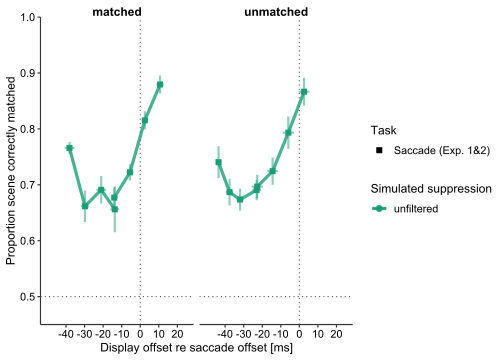<!-- -->

Here we start making a plot that does the same for the Replay Experiment
(for unfiltered vs suppression)

``` r
# RICHARD: added subj_id.x here
ISSPR_prop_correct <- ISSPR_data_without_overlap_metrics[experiment==4,
                             .(correct = mean(correct),
                               replay_sac_display_off_latency = mean(replay_sac_display_off_latency)),
                             by = .(experiment, common_subj_id, subj_id.x, sac_suppression_f,
                                    stim_dur_ms, stim_dur_ms_f)]

ISSPR_prop_correct[ , gm_correct := mean(correct), by = .(experiment)]
ISSPR_prop_correct[ , correct.w := correct - mean(correct) + gm_correct, by = .(experiment, common_subj_id)]
str(ISSPR_prop_correct$sac_suppression_f) # Richard: Why do you do this below? You already have the correct factor
```

    ##  Factor w/ 2 levels "original","suppressed": 1 1 2 2 2 2 2 2 2 2 ...

``` r
#ISSPR_prop_correct[ , sac_suppression_f:= factor ("filtered")]
# if you want to re-level, you can do this:
levels(ISSPR_prop_correct$sac_suppression_f) <- c("unfiltered", "filtered")
ISSPR_prop_correct[, fixreplay:= ("Replay (Exp. 4)")]


# if you check this, you find that all other subjects are also still included as NA:
table(ISSPR_prop_correct$common_subj_id, ISSPR_prop_correct$experiment, useNA="ifany")
```

    ##       
    ##          4
    ##   01    18
    ##   2     18
    ##   3     18
    ##   4     18
    ##   5     18
    ##   6     18
    ##   7     18
    ##   8     18
    ##   9     18
    ##   <NA> 198

``` r
ISSPR_prop_correct[is.na(common_subj_id), common_subj_id := "all others"]
table(ISSPR_data_without_overlap_metrics$common_subj_id, useNA = "ifany")
```

    ## 
    ##    01     2     3     4     5     6     7     8     9  <NA> 
    ##  1607  1469  1594  1551  1607  1595  1545  1586  1566 17397

``` r
# in this variable we code whether participants have a common_subj_id or not
ISSPR_prop_correct[common_subj_id == "all others", common_subj_id_exists_replay := "unmatched"]
ISSPR_prop_correct[common_subj_id != "all others", common_subj_id_exists_replay := "matched"]
table(ISSPR_prop_correct$common_subj_id, ISSPR_prop_correct$common_subj_id_exists_replay, useNA = "ifany")
```

    ##             
    ##              matched unmatched
    ##   01              18         0
    ##   2               18         0
    ##   3               18         0
    ##   4               18         0
    ##   5               18         0
    ##   6               18         0
    ##   7               18         0
    ##   8               18         0
    ##   9               18         0
    ##   all others       0       198

``` r
# Replay: population-level aggregate
ISSPR_prop_correct_agg <- ISSPR_prop_correct[ ,
                                                  .(correct = mean(correct.w),
                                                    correct_se = sd(correct.w) / sqrt(length(correct.w)),
                                                    replay_sac_display_off_latency = mean(replay_sac_display_off_latency),
                                                    replay_sac_display_off_latency_sd = sd(replay_sac_display_off_latency) /
                                                      sqrt(length(replay_sac_display_off_latency)) ),
                                                  by = .(common_subj_id_exists_replay, experiment,
                                                         stim_dur_ms, stim_dur_ms_f, fixreplay,
                                                         sac_suppression_f)]
ISSPR_prop_correct_agg
```

    ##     common_subj_id_exists_replay experiment stim_dur_ms stim_dur_ms_f
    ##                           <char>      <num>       <num>         <ord>
    ##  1:                      matched          4        8.33          8.33
    ##  2:                    unmatched          4        8.33          8.33
    ##  3:                    unmatched          4       16.67         16.67
    ##  4:                    unmatched          4       25.00            25
    ##  5:                      matched          4       25.00            25
    ##  6:                      matched          4       25.00            25
    ##  7:                      matched          4       33.33         33.33
    ##  8:                      matched          4        8.33          8.33
    ##  9:                    unmatched          4       33.33         33.33
    ## 10:                      matched          4       33.33         33.33
    ## 11:                    unmatched          4       33.33         33.33
    ## 12:                    unmatched          4        8.33          8.33
    ## 13:                      matched          4       16.67         16.67
    ## 14:                      matched          4       16.67         16.67
    ## 15:                    unmatched          4       25.00            25
    ## 16:                    unmatched          4       16.67         16.67
    ## 17:                      matched          4       41.67         41.67
    ## 18:                      matched          4       75.00            75
    ## 19:                      matched          4       41.67         41.67
    ## 20:                    unmatched          4       41.67         41.67
    ## 21:                      matched          4       50.00            50
    ## 22:                      matched          4       75.00            75
    ## 23:                    unmatched          4       75.00            75
    ## 24:                    unmatched          4       50.00            50
    ## 25:                      matched          4       66.67         66.67
    ## 26:                      matched          4       58.33         58.33
    ## 27:                    unmatched          4       58.33         58.33
    ## 28:                      matched          4       58.33         58.33
    ## 29:                      matched          4       66.67         66.67
    ## 30:                    unmatched          4       66.67         66.67
    ## 31:                    unmatched          4       41.67         41.67
    ## 32:                    unmatched          4       66.67         66.67
    ## 33:                      matched          4       50.00            50
    ## 34:                    unmatched          4       50.00            50
    ## 35:                    unmatched          4       75.00            75
    ## 36:                    unmatched          4       58.33         58.33
    ##     common_subj_id_exists_replay experiment stim_dur_ms stim_dur_ms_f
    ##           fixreplay sac_suppression_f   correct  correct_se
    ##              <char>            <fctr>     <num>       <num>
    ##  1: Replay (Exp. 4)        unfiltered 0.7495851 0.014539821
    ##  2: Replay (Exp. 4)        unfiltered 0.7476863 0.029646619
    ##  3: Replay (Exp. 4)          filtered 0.5764213 0.013401528
    ##  4: Replay (Exp. 4)          filtered 0.5619891 0.017860628
    ##  5: Replay (Exp. 4)          filtered 0.5492959 0.018415973
    ##  6: Replay (Exp. 4)        unfiltered 0.6613894 0.012088971
    ##  7: Replay (Exp. 4)        unfiltered 0.6845943 0.016587998
    ##  8: Replay (Exp. 4)          filtered 0.5959279 0.015186752
    ##  9: Replay (Exp. 4)        unfiltered 0.6764028 0.024823452
    ## 10: Replay (Exp. 4)          filtered 0.5634346 0.011713229
    ## 11: Replay (Exp. 4)          filtered 0.5630514 0.013372048
    ## 12: Replay (Exp. 4)          filtered 0.5851201 0.014736135
    ## 13: Replay (Exp. 4)          filtered 0.5393365 0.011736693
    ## 14: Replay (Exp. 4)        unfiltered 0.6946646 0.019383411
    ## 15: Replay (Exp. 4)        unfiltered 0.6556087 0.026987222
    ## 16: Replay (Exp. 4)        unfiltered 0.6799909 0.026846487
    ## 17: Replay (Exp. 4)          filtered 0.5755378 0.020141439
    ## 18: Replay (Exp. 4)          filtered 0.8832467 0.011872347
    ## 19: Replay (Exp. 4)        unfiltered 0.6672269 0.014707593
    ## 20: Replay (Exp. 4)        unfiltered 0.6850637 0.029024054
    ## 21: Replay (Exp. 4)        unfiltered 0.7804448 0.014946156
    ## 22: Replay (Exp. 4)        unfiltered 0.9073757 0.013921111
    ## 23: Replay (Exp. 4)        unfiltered 0.9418721 0.011446481
    ## 24: Replay (Exp. 4)        unfiltered 0.7314513 0.026244587
    ## 25: Replay (Exp. 4)        unfiltered 0.8661864 0.005499234
    ## 26: Replay (Exp. 4)          filtered 0.7576146 0.013225435
    ## 27: Replay (Exp. 4)          filtered 0.7103676 0.026344757
    ## 28: Replay (Exp. 4)        unfiltered 0.7893607 0.012828090
    ## 29: Replay (Exp. 4)          filtered 0.8220757 0.014581958
    ## 30: Replay (Exp. 4)          filtered 0.8194528 0.029277704
    ## 31: Replay (Exp. 4)          filtered 0.5766983 0.017536711
    ## 32: Replay (Exp. 4)        unfiltered 0.8736925 0.023858965
    ## 33: Replay (Exp. 4)          filtered 0.6685852 0.022343590
    ## 34: Replay (Exp. 4)          filtered 0.6561418 0.024321748
    ## 35: Replay (Exp. 4)          filtered 0.8894614 0.021455029
    ## 36: Replay (Exp. 4)        unfiltered 0.8254103 0.024282351
    ##           fixreplay sac_suppression_f   correct  correct_se
    ##     replay_sac_display_off_latency replay_sac_display_off_latency_sd
    ##                              <num>                             <num>
    ##  1:                    -43.3154141                         0.3705094
    ##  2:                    -42.3318116                         0.2883880
    ##  3:                    -35.5117064                         0.4122946
    ##  4:                    -31.5600815                         0.4947230
    ##  5:                    -30.9882047                         0.9200203
    ##  6:                    -28.8276221                         0.4100485
    ##  7:                    -19.7079238                         0.4864622
    ##  8:                    -43.0968044                         0.3420216
    ##  9:                    -18.9664383                         0.4070679
    ## 10:                    -20.1817776                         0.6148157
    ## 11:                    -19.8405498                         0.2982914
    ## 12:                    -42.5083169                         0.4172745
    ## 13:                    -35.7369589                         0.4424707
    ## 14:                    -37.2390760                         0.5578372
    ## 15:                    -28.4627179                         0.5561391
    ## 16:                    -36.7497265                         0.4670724
    ## 17:                    -10.3471551                         0.2639504
    ## 18:                     24.0633392                         0.4948247
    ## 19:                    -10.9344098                         0.3964592
    ## 20:                    -11.0463405                         0.3521261
    ## 21:                     -0.1110145                         0.4396266
    ## 22:                     24.1633110                         0.3389586
    ## 23:                     24.4740997                         0.4934006
    ## 24:                     -0.8733318                         0.4108166
    ## 25:                     14.7947322                         0.6174367
    ## 26:                      6.2164785                         0.7361479
    ## 27:                      5.9728118                         0.6466634
    ## 28:                      6.4939714                         0.5323409
    ## 29:                     16.2520720                         0.7573837
    ## 30:                     15.8919704                         0.7947639
    ## 31:                    -11.1563790                         0.3402765
    ## 32:                     14.3012344                         0.4386188
    ## 33:                     -0.4542593                         0.6212758
    ## 34:                     -1.4193474                         0.4337604
    ## 35:                     24.7578276                         0.4974431
    ## 36:                      6.8960082                         0.1313367
    ##     replay_sac_display_off_latency replay_sac_display_off_latency_sd

Here we create the Plot for Prop. Correct; ISSP Replay and
common_subj_id

Mara Comment: Here is the same problem; the legend changed when Iam
using (scale_color_manual(values = experiment_colorscale)), what is the
mistake here?

Richard Response: Not sure what you mean. You did not use the command
above but a different one (commented below), so I would not be surprised
to see the color code change… it should be fixed now.

``` r
ISSPR_prop_subj <- ggplot(data = ISSPR_prop_correct[common_subj_id != "all others"],
                         aes(x = replay_sac_display_off_latency, y = correct, color = sac_suppression_f,
                             shape = fixreplay,
                             group = paste(experiment, sac_suppression_f)))+
  geom_vline(xintercept = 0, linetype = "dotted", alpha = 0.7) +
  geom_hline(yintercept = 0.5, linetype = "dotted", alpha = 0.7) +
  geom_line(size = 1.5, alpha = 0.8) +
  geom_point(size = 2.5) +
  theme_classic(base_size = 12.5) + ocimTheme() +
  coord_cartesian(ylim = c(0.45, 1)) +
  #scale_color_viridis_d(option = "cividis", end = 0.4, direction = -1, guide = guide_legend(reverse = TRUE)) +
  scale_color_manual(values = experiment_colorscale) + 
  scale_shape_manual(values = c(15, 17)) +
  scale_y_continuous(expand = c(0,0)) +
  scale_x_continuous(breaks = c(-40, -30, -20, -10, 0, 10, 20), limits = figure2_xlim_issp12) +
  labs(x = "Display offset re saccade offset [ms]", y = "Proportion scene correctly matched",
       color = "Simulated suppression", fill = "Simulated suppression", shape = "Task") +
  facet_wrap(~common_subj_id)

ISSPR_prop_subj
```

    ## Warning: Removed 1 row containing missing values or values outside the scale range
    ## (`geom_line()`).

    ## Warning: Removed 5 rows containing missing values or values outside the scale range
    ## (`geom_point()`).

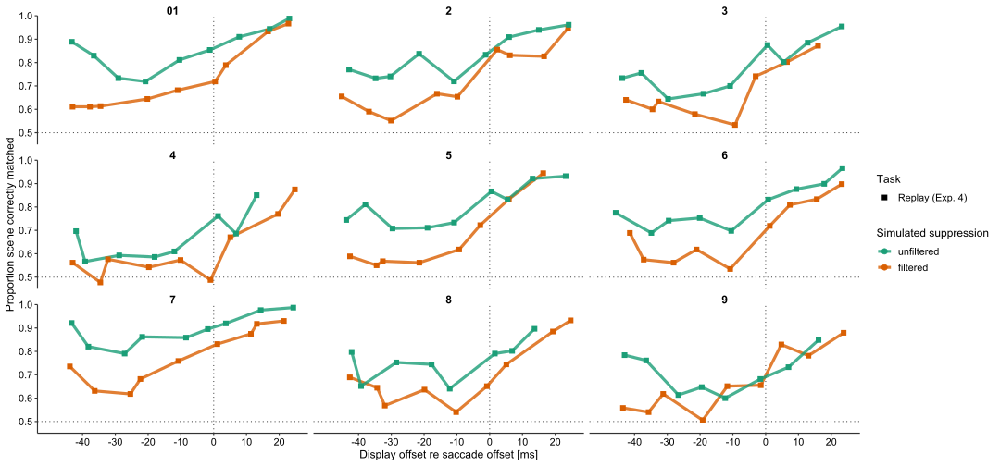<!-- -->

Here, this plot contains the population aggregate for participants for
Replay Condition

``` r
ISSPR_prop <- ggplot(data = ISSPR_prop_correct_agg,
                         aes(x = replay_sac_display_off_latency, y = correct, color = sac_suppression_f,
                             shape = fixreplay,
                             group = paste(experiment, sac_suppression_f)))+
  geom_vline(xintercept = 0, linetype = "dotted", alpha = 0.7) +
  geom_hline(yintercept = 0.5, linetype = "dotted", alpha = 0.7) +
  geom_errorbar(aes(ymax = correct + correct_se, ymin = correct - correct_se),
                width = 0, size = 1, alpha = 0.5) +
  geom_errorbarh(aes(xmax = replay_sac_display_off_latency + replay_sac_display_off_latency_sd,
                     xmin = replay_sac_display_off_latency - replay_sac_display_off_latency_sd),
                 height = 0, size = 1, alpha = 0.5) +
  geom_line(size = 1.5, alpha = 0.8) +
  geom_point(size = 2.5) +
  theme_classic(base_size = 12.5) + ocimTheme() +
  coord_cartesian(ylim = c(0.45, 1)) +
  scale_color_manual(values = experiment_colorscale, guide = guide_legend(reverse = TRUE)) +
  scale_shape_manual(values = c(15, 17)) +
  scale_y_continuous(expand = c(0,0)) +
  scale_x_continuous(breaks = c(-40, -30, -20, -10, 0, 10, 20), limits = figure2_xlim_issp12) +
  labs(x = "Display offset re saccade offset [ms]", y = "Proportion scene correctly matched",
       color = "Simulated suppression", fill = "Simulated suppression", shape = "Task") +
  facet_wrap(~common_subj_id_exists_replay)

ISSPR_prop
```

    ## Warning: Removed 1 row containing missing values or values outside the scale range
    ## (`geom_errorbarh()`).

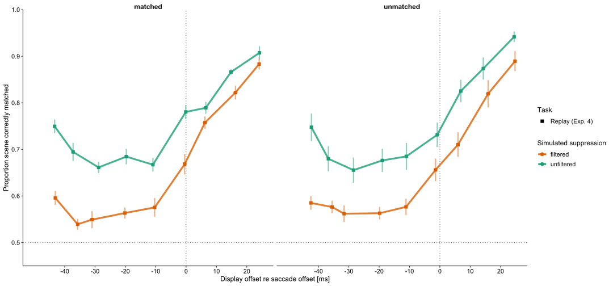<!-- -->

Here we combine saccade and replay condition in one Plot for N=9

``` r
ggplot()+
  geom_point(data=ISSPR_prop_correct[common_subj_id != "all others"],
             aes(x = replay_sac_display_off_latency, y = correct, color = sac_suppression_f,
                 shape = fixreplay,
                 group = paste(experiment, sac_suppression_f)))+
  geom_vline(xintercept = 0, linetype = "dotted", alpha = 0.7) +
  geom_hline(yintercept = 0.5, linetype = "dotted", alpha = 0.7) +
  geom_line(data=ISSPR_prop_correct[common_subj_id != "all others"],
             aes(x = replay_sac_display_off_latency, y = correct, color = sac_suppression_f,
                 linetype = fixreplay,
                 group = paste(experiment, sac_suppression_f)),
            size = 1.5, alpha = 0.8) +
  labs(x = "Display offset re saccade offset [ms]", y = "Proportion scene correctly matched",
       color = "Simulated suppression", fill = "Simulated suppression", shape = "Task") +
  geom_point(data= issp12_prop_correct[common_subj_id != "all others"],
             aes(x = sac_display_off_latency, y = correct, color = sac_suppression_f,
                 shape = fixreplay,
                 group = paste(experiment_f, color_yes_f)))+
  geom_vline(xintercept = 0, linetype = "dotted", alpha = 0.7) +
  geom_hline(yintercept = 0.5, linetype = "dotted", alpha = 0.7) +
  geom_line(data= issp12_prop_correct[common_subj_id != "all others"],
             aes(x = sac_display_off_latency, y = correct, color = sac_suppression_f,
                 linetype = fixreplay,
                 group = paste(experiment_f, color_yes_f)),
            size = 1.5, alpha = 0.8) +
  theme_classic(base_size = 12.5) + ocimTheme() +
  coord_cartesian(ylim = c(0.45, 1)) +
  scale_color_manual(values = experiment_colorscale, guide = guide_legend(reverse = TRUE)) +
  scale_shape_manual(values = c(15, 17)) +
  scale_y_continuous(expand = c(0,0)) +
  scale_x_continuous(breaks = c(-40, -30, -20, -10, 0, 10, 20)) +
  labs(x = "Display offset re saccade offset [ms]", y = "Proportion scene correctly matched",
       color = "Simulated suppression", fill = "Simulated suppression", shape = "Task",
       linetype = "Task") +
  facet_wrap(~common_subj_id)
```

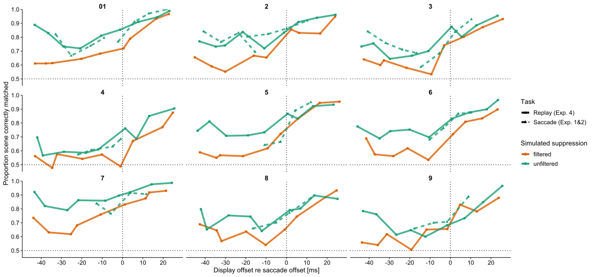<!-- -->

Here I want to combine the plots of the population aggregate for
participants that are matched across experiments (common_subj_ids 1-9)
and those that are not

``` r
issp12_prop_correct_agg[ , common_subj_id_exists_replay := common_subj_id_exists]

ggplot()+
  geom_vline(xintercept = 0, linetype = "dotted", alpha = 0.7) +
  geom_hline(yintercept = 0.5, linetype = "dotted", alpha = 0.7) +
  geom_point(data=issp12_prop_correct_agg,
             aes(x = sac_display_off_latency, y = correct, color = sac_suppression_f,
                 shape = fixreplay,
                 group = paste(experiment_f, color_yes_f)), size = 2)+
  geom_line(data=issp12_prop_correct_agg,
            aes(x = sac_display_off_latency, y = correct, color = sac_suppression_f,
                linetype = fixreplay,
                group = paste(experiment_f, color_yes_f)),
            size = 1.5, alpha = 0.8) +
  labs(x = "Display offset re saccade offset [ms]", y = "Proportion scene correctly matched",
       color = "Simulated suppression", fill = "Simulated suppression", shape = "Task") +
  geom_point(data = ISSPR_prop_correct_agg,
             aes(x = replay_sac_display_off_latency, y = correct, color = sac_suppression_f,
                 shape = fixreplay,
                 group = paste(experiment, sac_suppression_f)), size = 2) +
  geom_line(data = ISSPR_prop_correct_agg,
             aes(x = replay_sac_display_off_latency, y = correct, color = sac_suppression_f,
                 group = paste(experiment, sac_suppression_f)),
            size = 1.5, alpha = 0.8) +
  geom_errorbar(data = ISSPR_prop_correct_agg,
                aes(x = replay_sac_display_off_latency, color = sac_suppression_f,
                    ymax = correct + correct_se, ymin = correct - correct_se),
                width = 0, size = 1, alpha = 1) +
  geom_errorbarh(data = ISSPR_prop_correct_agg,
                 aes(y = correct, color = sac_suppression_f,
                     xmax = replay_sac_display_off_latency + replay_sac_display_off_latency_sd,
                     xmin = replay_sac_display_off_latency - replay_sac_display_off_latency_sd),
                 height = 0, size = 1, alpha = 1) +
  theme_classic(base_size = 12.5) + ocimTheme() +
  coord_cartesian(ylim = c(0.45, 1)) +
  scale_color_manual(values = experiment_colorscale, guide = guide_legend(reverse = TRUE))+
  scale_shape_manual(values = c(15, 17)) +
  scale_linetype_manual(values = c("dashed", "solid")) +
  scale_y_continuous(expand = c(0,0)) +
  scale_x_continuous(breaks = c(-40, -30, -20, -10, 0, 10, 20), limits = figure2_xlim_issp12) +
  labs(x = "Display offset re saccade offset [ms]", y = "Proportion scene correctly matched",
       color = "Simulated suppression", fill = "Simulated suppression", shape = "Task",
       linetype = "Task") +
  facet_wrap(~common_subj_id_exists_replay)
```

    ## Warning: Removed 1 row containing missing values or values outside the scale range
    ## (`geom_errorbarh()`).

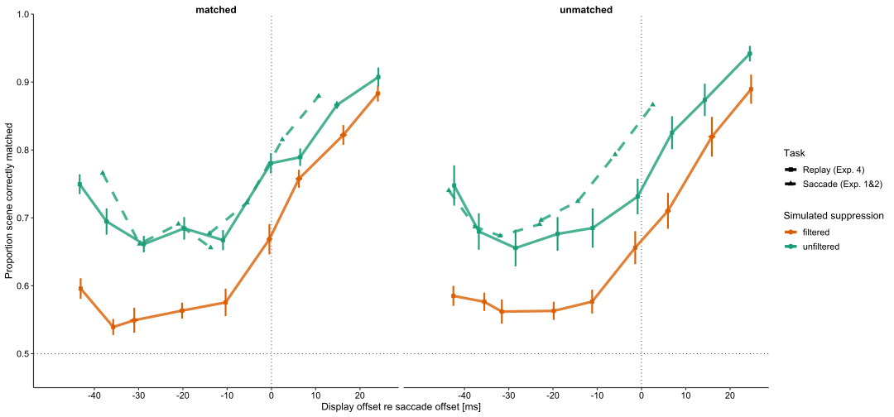<!-- -->

Here we start with statistic differences between saccade/replay
condition First: within subject (VP (N=9) data from Exp 2 + Replay) for
the UNFILTERED condition. Mara Comment: Would it be better to different
here excatly that is is only Saccade (Exp. 2) in the legend?

Richard Comment: Yes, saccade (Exp. 2) would certainly be more suitable.
But I guess you can edit this manually later when you export the figure
as svg or pdf. Furthermore, if you use ezPlot, then you should try to
keep the style consistent to your other figures. Especially, different
color schemes suggest that something else is plotted there. As you have
seen below, I have tried my best to adjust the style to match the figure
above, but line and point size is still not the same. Whatever you do in
this chunk, please also apply to all the subsequent ezPlot commands.

Finally, one important thing: Here you use the same color scale you use
to compare original vs suppressed (or unfiltered vs filtered, you would
have to decide for one way) to compare experiments! That is extremely
confusing and should really be avoided. When you compare viewing
conditions (saccade vs replay) you should really use a different color
scale.

``` r
# okay, below we merge the data of Experiment 2 and Replay (n=9) with unfiltered condition
table(issp$experiment, issp$common_subj_id, useNA = "ifany")
```

    ##    
    ##        01     2     3     4     5     6     7     8     9  <NA>
    ##   1  1015  1057  1231     0     0     0     0     0     0 10999
    ##   2   796   822   679   585   820   589   815  1078   849  8197
    ##   3     0     0     0     0     0     0     0     0     0 12687

``` r
table(issp$stim_dur_ms_f, useNA = "ifany")
```

    ## 
    ##  8.33 16.67    25 33.33 41.67    50 58.33 66.67 
    ##  4572  5041  5358  9279  5379  5490  5481  1619

``` r
common_subj_id_subset_issp12 <- issp12_prop_correct[common_subj_id!="all others" & stim_dur_ms < 60 &
                                                      experiment_f == "2"]
table(common_subj_id_subset_issp12$experiment, common_subj_id_subset_issp12$common_subj_id, useNA = "ifany")
```

    ##    
    ##     01 2 3 4 5 6 7 8 9
    ##   1  0 0 0 0 0 0 0 0 0
    ##   2  4 4 4 4 4 4 4 4 4
    ##   3  0 0 0 0 0 0 0 0 0

``` r
table(common_subj_id_subset_issp12$stim_dur_ms, common_subj_id_subset_issp12$common_subj_id, useNA = "ifany")
```

    ##        
    ##         01 2 3 4 5 6 7 8 9
    ##   33.33  1 1 1 1 1 1 1 1 1
    ##   41.67  1 1 1 1 1 1 1 1 1
    ##   50     1 1 1 1 1 1 1 1 1
    ##   58.33  1 1 1 1 1 1 1 1 1

``` r
# Replay Experiment=4, common_subj_id = 1-9
table(ISSPR_prop_correct$experiment, ISSPR_prop_correct$common_subj_id,
      ISSPR_prop_correct$common_subj_id_exists_replay, useNA = "ifany")
```

    ## , ,  = matched
    ## 
    ##    
    ##      01   2   3   4   5   6   7   8   9 all others
    ##   4  18  18  18  18  18  18  18  18  18          0
    ## 
    ## , ,  = unmatched
    ## 
    ##    
    ##      01   2   3   4   5   6   7   8   9 all others
    ##   4   0   0   0   0   0   0   0   0   0        198

``` r
table(ISSPR_data_without_overlap_metrics$stim_dur_ms, useNA = "ifany")
```

    ## 
    ##  8.33 16.67    25 33.33 41.67    50 58.33 66.67    75 
    ##  3553  3525  3519  3499  3474  3486  3505  3493  3463

``` r
common_subj_id_subset_ISSPR <- ISSPR_prop_correct[common_subj_id!="all others" &
                                                    stim_dur_ms > 30 & stim_dur_ms < 60 &
                                                    sac_suppression_f=="unfiltered"] # choose condition here!
table(common_subj_id_subset_ISSPR$experiment, common_subj_id_subset_ISSPR$common_subj_id)
```

    ##    
    ##     01 2 3 4 5 6 7 8 9
    ##   4  4 4 4 4 4 4 4 4 4

``` r
table(common_subj_id_subset_ISSPR$stim_dur_ms, common_subj_id_subset_ISSPR$common_subj_id)
```

    ##        
    ##         01 2 3 4 5 6 7 8 9
    ##   33.33  1 1 1 1 1 1 1 1 1
    ##   41.67  1 1 1 1 1 1 1 1 1
    ##   50     1 1 1 1 1 1 1 1 1
    ##   58.33  1 1 1 1 1 1 1 1 1

``` r
# combine the two sets to perform an ANOVA
subset_ISSPexperiments <- rbindlist(list(common_subj_id_subset_issp12 , common_subj_id_subset_ISSPR),
                                    fill = TRUE)
# verify that all conditions are comparable (we need one value in each cell)
table(subset_ISSPexperiments$common_subj_id, subset_ISSPexperiments$stim_dur_ms,
      subset_ISSPexperiments$fixreplay, useNA = "ifany")
```

    ## , ,  = Replay (Exp. 4)
    ## 
    ##     
    ##      33.33 41.67 50 58.33
    ##   01     1     1  1     1
    ##   2      1     1  1     1
    ##   3      1     1  1     1
    ##   4      1     1  1     1
    ##   5      1     1  1     1
    ##   6      1     1  1     1
    ##   7      1     1  1     1
    ##   8      1     1  1     1
    ##   9      1     1  1     1
    ## 
    ## , ,  = Saccade (Exp. 1&2)
    ## 
    ##     
    ##      33.33 41.67 50 58.33
    ##   01     1     1  1     1
    ##   2      1     1  1     1
    ##   3      1     1  1     1
    ##   4      1     1  1     1
    ##   5      1     1  1     1
    ##   6      1     1  1     1
    ##   7      1     1  1     1
    ##   8      1     1  1     1
    ##   9      1     1  1     1

``` r
# perform ANOVA
ezANOVA(data = subset_ISSPexperiments, wid = .(common_subj_id), dv = .(correct),
        within = .(fixreplay, stim_dur_ms_f), detailed = TRUE)
```

    ## Warning: Converting "common_subj_id" to factor for ANOVA.

    ## Warning: Converting "fixreplay" to factor for ANOVA.

    ## Warning: You have removed one or more levels from variable "stim_dur_ms_f".
    ## Refactoring for ANOVA.

    ## $ANOVA
    ##                    Effect DFn DFd          SSn        SSd          F
    ## 1             (Intercept)   1   8 43.646529352 0.36782904 949.278595
    ## 2               fixreplay   1   8  0.004113641 0.02818839   1.167471
    ## 3           stim_dur_ms_f   3  24  0.310094491 0.06776872  36.606206
    ## 4 fixreplay:stim_dur_ms_f   3  24  0.022411579 0.03785771   4.735961
    ##              p p<.05         ges
    ## 1 1.338202e-09     * 0.988637268
    ## 2 3.114152e-01       0.008133624
    ## 3 4.076388e-09     * 0.382012859
    ## 4 9.842201e-03     * 0.042765663
    ## 
    ## $`Mauchly's Test for Sphericity`
    ##                    Effect         W         p p<.05
    ## 3           stim_dur_ms_f 0.5066046 0.4749752      
    ## 4 fixreplay:stim_dur_ms_f 0.8783867 0.9725533      
    ## 
    ## $`Sphericity Corrections`
    ##                    Effect       GGe        p[GG] p[GG]<.05       HFe
    ## 3           stim_dur_ms_f 0.6722833 9.740248e-07         * 0.8998408
    ## 4 fixreplay:stim_dur_ms_f 0.9246474 1.204065e-02         * 1.4648058
    ##          p[HF] p[HF]<.05
    ## 3 2.161679e-08         *
    ## 4 9.842201e-03         *

``` r
ezStats(data = subset_ISSPexperiments, wid = .(common_subj_id), dv = .(correct),
        within_full = .(fixreplay, stim_dur_ms_f), within = .(fixreplay))
```

    ## Warning: Converting "common_subj_id" to factor for ANOVA.

    ## Warning: Converting "fixreplay" to factor for ANOVA.

    ## Warning: Collapsing data to cell means first using variables supplied to
    ## "within_full", then collapsing the resulting means to means for the cells
    ## supplied to "within".

    ##            fixreplay N      Mean         SD       FLSD
    ## 1    Replay (Exp. 4) 9 0.7710309 0.07338112 0.03226369
    ## 2 Saccade (Exp. 1&2) 9 0.7861483 0.08361074 0.03226369

``` r
# plot to evaluate ANOVA results
ezPlot(data = subset_ISSPexperiments, wid = .(common_subj_id), dv = .(correct),
       within = .(fixreplay, stim_dur_ms_f),
       x = .(stim_dur_ms_f), split = .(fixreplay), 
       bar_width = 0.00001
       ) +
  labs(y = "Proportion scene correctly matched")+
  labs(x = "Display Duration [ms]",
       color = "Task"#,
       #linetype = "Task",
       #shape = "Task"
  ) +
  scale_linetype_manual(values = c("solid", "solid")) + 
  scale_shape_manual(values = c(15, 15)) +
  theme_classic(base_size = 12.5) + ocimTheme() +
  coord_cartesian(ylim = c(0.45, 1)) +
  scale_color_manual(values = experiment_colorscale, guide = guide_legend(reverse = TRUE))
```

    ## Warning: Converting "common_subj_id" to factor for ANOVA.

    ## Warning: Converting "fixreplay" to factor for ANOVA.

    ## Warning: You have removed one or more levels from variable "stim_dur_ms_f".
    ## Refactoring for ANOVA.

<!-- -->

Second: within subject (VP (N=9) data from Exp 2 + Replay) for the
FILTERED condition. Mama Comment: Same question like above; Legend
changes?

``` r
common_subj_id_subset_ISSPR_filt <- ISSPR_prop_correct[common_subj_id!="all others" &
                                                         stim_dur_ms > 30 & stim_dur_ms < 60 &
                                                         sac_suppression_f=="filtered"] # choose condition

# okay, merge
subset_ISSPexperiments_filt <- rbindlist(list(common_subj_id_subset_issp12,
                                              common_subj_id_subset_ISSPR_filt),
                                         fill = TRUE)
# make sure we have the variable stim_dur_ms_f for ANOVA in both frames
table(subset_ISSPexperiments_filt$common_subj_id, subset_ISSPexperiments_filt$stim_dur_ms_f,
      subset_ISSPexperiments_filt$fixreplay, useNA = "ifany")
```

    ## , ,  = Replay (Exp. 4)
    ## 
    ##     
    ##      8.33 16.67 25 33.33 41.67 50 58.33 66.67 75
    ##   01    0     0  0     1     1  1     1     0  0
    ##   2     0     0  0     1     1  1     1     0  0
    ##   3     0     0  0     1     1  1     1     0  0
    ##   4     0     0  0     1     1  1     1     0  0
    ##   5     0     0  0     1     1  1     1     0  0
    ##   6     0     0  0     1     1  1     1     0  0
    ##   7     0     0  0     1     1  1     1     0  0
    ##   8     0     0  0     1     1  1     1     0  0
    ##   9     0     0  0     1     1  1     1     0  0
    ## 
    ## , ,  = Saccade (Exp. 1&2)
    ## 
    ##     
    ##      8.33 16.67 25 33.33 41.67 50 58.33 66.67 75
    ##   01    0     0  0     1     1  1     1     0  0
    ##   2     0     0  0     1     1  1     1     0  0
    ##   3     0     0  0     1     1  1     1     0  0
    ##   4     0     0  0     1     1  1     1     0  0
    ##   5     0     0  0     1     1  1     1     0  0
    ##   6     0     0  0     1     1  1     1     0  0
    ##   7     0     0  0     1     1  1     1     0  0
    ##   8     0     0  0     1     1  1     1     0  0
    ##   9     0     0  0     1     1  1     1     0  0

``` r
# perform ANOVA
ezANOVA(data = subset_ISSPexperiments_filt, wid = .(common_subj_id), dv = .(correct),
        within = .(fixreplay, stim_dur_ms_f), detailed = TRUE)
```

    ## Warning: Converting "common_subj_id" to factor for ANOVA.

    ## Warning: Converting "fixreplay" to factor for ANOVA.

    ## Warning: You have removed one or more levels from variable "stim_dur_ms_f".
    ## Refactoring for ANOVA.

    ## $ANOVA
    ##                    Effect DFn DFd          SSn        SSd           F
    ## 1             (Intercept)   1   8 38.793899183 0.32163416 964.9198679
    ## 2               fixreplay   1   8  0.195553937 0.02968323  52.7042233
    ## 3           stim_dur_ms_f   3  24  0.441893574 0.08853607  39.9289064
    ## 4 fixreplay:stim_dur_ms_f   3  24  0.003935175 0.04851879   0.6488496
    ##              p p<.05         ges
    ## 1 1.254132e-09     * 0.987567617
    ## 2 8.722228e-05     * 0.285928421
    ## 3 1.733073e-09     * 0.475018601
    ## 4 5.913563e-01       0.007993329
    ## 
    ## $`Mauchly's Test for Sphericity`
    ##                    Effect         W         p p<.05
    ## 3           stim_dur_ms_f 0.4672714 0.4068884      
    ## 4 fixreplay:stim_dur_ms_f 0.5084917 0.4782709      
    ## 
    ## $`Sphericity Corrections`
    ##                    Effect       GGe        p[GG] p[GG]<.05      HFe
    ## 3           stim_dur_ms_f 0.7125989 2.680490e-07         * 0.980301
    ## 4 fixreplay:stim_dur_ms_f 0.7590384 5.534563e-01           1.077198
    ##          p[HF] p[HF]<.05
    ## 3 2.445534e-09         *
    ## 4 5.913563e-01

``` r
ezStats(data = subset_ISSPexperiments_filt, wid = .(common_subj_id), dv = .(correct),
        within_full = .(fixreplay, stim_dur_ms_f), within = .(fixreplay))
```

    ## Warning: Converting "common_subj_id" to factor for ANOVA.

    ## Warning: Converting "fixreplay" to factor for ANOVA.

    ## Warning: Collapsing data to cell means first using variables supplied to
    ## "within_full", then collapsing the resulting means to means for the cells
    ## supplied to "within".

    ##            fixreplay N      Mean         SD       FLSD
    ## 1    Replay (Exp. 4) 9 0.6819173 0.06314992 0.03310811
    ## 2 Saccade (Exp. 1&2) 9 0.7861483 0.08361074 0.03310811

``` r
ezPlot(data = subset_ISSPexperiments_filt, wid = .(common_subj_id), dv = .(correct),
        within = .(fixreplay, stim_dur_ms_f),
       x = .(stim_dur_ms_f), split = .(fixreplay))+scale_color_manual(values = experiment_colorscale)+
      labs(y = "Proportion scene correctly matched")+
      labs(x = "Display Duration [ms]",
       color = "Task",
       linetype = "Task",
       shape = "Task")
```

    ## Warning: Converting "common_subj_id" to factor for ANOVA.

    ## Warning: Converting "fixreplay" to factor for ANOVA.

    ## Warning: You have removed one or more levels from variable "stim_dur_ms_f".
    ## Refactoring for ANOVA.

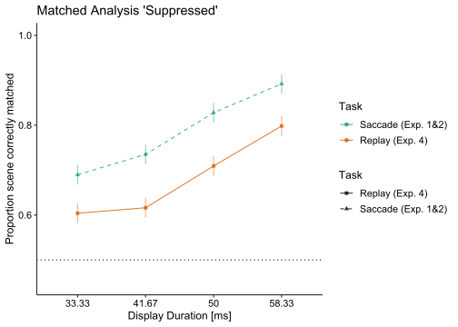<!-- -->

Subj. not in both conditions; between (bw) design N=11; no-common
subjects! “Original condition”

``` r
# not-common subjects in saccade exp
common_subj_id_subset_issp12_bw <- issp12_prop_correct[common_subj_id== "all others" &
                                                         stim_dur_ms < 60 & experiment_f == "2"]
# recode the subj_id
common_subj_id_subset_issp12_bw[ , subj_id := as.character(as.numeric(as.ordered(subj_id)))] # 1-11
table(common_subj_id_subset_issp12_bw$experiment, common_subj_id_subset_issp12_bw$subj_id,
      common_subj_id_subset_issp12_bw$common_subj_id)
```

    ## , ,  = all others
    ## 
    ##    
    ##     1 10 11 2 3 4 5 6 7 8 9
    ##   1 0  0  0 0 0 0 0 0 0 0 0
    ##   2 4  4  4 4 4 4 4 4 4 4 4
    ##   3 0  0  0 0 0 0 0 0 0 0 0

``` r
table(common_subj_id_subset_issp12_bw$stim_dur_ms, common_subj_id_subset_issp12_bw$subj_id)
```

    ##        
    ##         1 10 11 2 3 4 5 6 7 8 9
    ##   33.33 1  1  1 1 1 1 1 1 1 1 1
    ##   41.67 1  1  1 1 1 1 1 1 1 1 1
    ##   50    1  1  1 1 1 1 1 1 1 1 1
    ##   58.33 1  1  1 1 1 1 1 1 1 1 1

``` r
# not-common subjects in replay; ISSPR
ISSPR_data_without_overlap_metrics[ , subj_id := subj_id.x]
table(ISSPR_data_without_overlap_metrics$stim_dur_ms, ISSPR_data_without_overlap_metrics$subj_id)
```

    ##        
    ##          08  11  12  13  15  16  17  18  19  20  21  22  P1  P2  P3  P4  P5  P6
    ##   8.33  174 179 177 179 179 179 173 177 178 179 180 174 180 180 174 179 178 179
    ##   16.67 175 175 175 170 180 173 177 178 174 179 179 177 179 178 169 177 178 179
    ##   25    177 178 178 176 177 177 169 178 175 177 178 175 177 178 168 178 171 177
    ##   33.33 172 180 172 170 178 175 166 177 176 178 178 176 179 179 164 178 170 178
    ##   41.67 176 179 174 172 180 179 167 173 169 176 178 172 179 178 160 172 164 178
    ##   50    175 178 174 169 180 176 170 173 173 172 176 174 180 178 167 178 170 177
    ##   58.33 174 177 178 178 180 179 170 172 176 176 177 179 179 179 154 178 174 178
    ##   66.67 173 180 177 176 178 175 170 176 173 174 177 175 179 179 158 179 174 177
    ##   75    170 179 178 173 179 172 161 170 177 175 180 177 175 178 155 176 172 177
    ##        
    ##          P7  P9
    ##   8.33  179 176
    ##   16.67 180 173
    ##   25    180 175
    ##   33.33 178 175
    ##   41.67 180 168
    ##   50    177 169
    ##   58.33 172 175
    ##   66.67 173 170
    ##   75    175 164

``` r
ISSPR_allothers_correct <- ISSPR_data_without_overlap_metrics[is.na(common_subj_id) & # only those who do not have a common subj id
                                                                experiment==4 &
                                                                stim_dur_ms > 30 & stim_dur_ms < 60,
                             .(correct = mean(correct),
                               replay_sac_display_off_latency = mean(replay_sac_display_off_latency)),
                             by = .(experiment, subj_id, sac_suppression_f, stim_dur_ms, stim_dur_ms_f)]
ISSPR_allothers_correct$fixreplay <- "Replay (Exp. 4)"

# recode the subj_id
ISSPR_allothers_correct[ , subj_id := as.character(as.numeric(as.ordered(subj_id)))] # 1-11
table(ISSPR_allothers_correct$stim_dur_ms, ISSPR_allothers_correct$subj_id)
```

    ##        
    ##         1 10 11 2 3 4 5 6 7 8 9
    ##   33.33 2  2  2 2 2 2 2 2 2 2 2
    ##   41.67 2  2  2 2 2 2 2 2 2 2 2
    ##   50    2  2  2 2 2 2 2 2 2 2 2
    ##   58.33 2  2  2 2 2 2 2 2 2 2 2

``` r
# within-subj variance here
ISSPR_allothers_correct[ , gm_correct := mean(correct), by = .(experiment)]
ISSPR_allothers_correct[ , correct.w := correct - mean(correct) + gm_correct, by = .(experiment, subj_id)]

# combine the two sets to perform an ANOVA,  Original Condition for filtered images
# DECIDE HERE WHETHER ORIGINAL OR FILTERED IMAGES SHOULD BE COMPARED WITH SACCADE CONDITION (original vs suppressed)
subset_ISSPexperiments_bw <- rbindlist(list(common_subj_id_subset_issp12_bw,
                                            ISSPR_allothers_correct[sac_suppression_f=="original"]),
                                    fill = TRUE)

# verify that all conditions are comparable and we have the same number of (independent) subjects
table(subset_ISSPexperiments_bw$subj_id, subset_ISSPexperiments_bw$stim_dur_ms,
      subset_ISSPexperiments_bw$fixreplay, useNA = "ifany")
```

    ## , ,  = Replay (Exp. 4)
    ## 
    ##     
    ##      33.33 41.67 50 58.33
    ##   1      1     1  1     1
    ##   10     1     1  1     1
    ##   11     1     1  1     1
    ##   2      1     1  1     1
    ##   3      1     1  1     1
    ##   4      1     1  1     1
    ##   5      1     1  1     1
    ##   6      1     1  1     1
    ##   7      1     1  1     1
    ##   8      1     1  1     1
    ##   9      1     1  1     1
    ## 
    ## , ,  = Saccade (Exp. 1&2)
    ## 
    ##     
    ##      33.33 41.67 50 58.33
    ##   1      1     1  1     1
    ##   10     1     1  1     1
    ##   11     1     1  1     1
    ##   2      1     1  1     1
    ##   3      1     1  1     1
    ##   4      1     1  1     1
    ##   5      1     1  1     1
    ##   6      1     1  1     1
    ##   7      1     1  1     1
    ##   8      1     1  1     1
    ##   9      1     1  1     1

``` r
# convert subj_id to factor
subset_ISSPexperiments_bw[ , subj_id := factor(subj_id)]
subset_ISSPexperiments_bw[ , fixreplay_f := factor(fixreplay)]
subset_ISSPexperiments_bw[ , stim_dur_ms_f := droplevels(stim_dur_ms_f)]
table(subset_ISSPexperiments_bw$subj_id, subset_ISSPexperiments_bw$stim_dur_ms_f)
```

    ##     
    ##      33.33 41.67 50 58.33
    ##   1      2     2  2     2
    ##   10     2     2  2     2
    ##   11     2     2  2     2
    ##   2      2     2  2     2
    ##   3      2     2  2     2
    ##   4      2     2  2     2
    ##   5      2     2  2     2
    ##   6      2     2  2     2
    ##   7      2     2  2     2
    ##   8      2     2  2     2
    ##   9      2     2  2     2

``` r
# perform ANOVA
ezANOVA(data = subset_ISSPexperiments_bw, wid = .(subj_id), dv = .(correct),
        between = .(fixreplay),
        within = .(stim_dur_ms_f),
        detailed = TRUE)
```

    ## Warning: Converting "fixreplay" to factor for ANOVA.

    ## Warning: The column supplied as the wid variable contains non-unique values
    ## across levels of the supplied between-Ss variables. Automatically fixing this
    ## by generating unique wid labels.

    ## $ANOVA
    ##                    Effect DFn DFd         SSn       SSd            F
    ## 1             (Intercept)   1  20 46.65504055 0.4454751 2094.6193003
    ## 2               fixreplay   1  20  0.08890154 0.4454751    3.9913131
    ## 3           stim_dur_ms_f   3  60  0.33969987 0.1325967   51.2380514
    ## 4 fixreplay:stim_dur_ms_f   3  60  0.00474857 0.1325967    0.7162424
    ##              p p<.05         ges
    ## 1 1.013566e-21     * 0.987761301
    ## 2 5.951845e-02       0.133290981
    ## 3 1.503396e-16     * 0.370135471
    ## 4 5.461552e-01       0.008147569
    ## 
    ## $`Mauchly's Test for Sphericity`
    ##                    Effect         W         p p<.05
    ## 3           stim_dur_ms_f 0.7406776 0.3455237      
    ## 4 fixreplay:stim_dur_ms_f 0.7406776 0.3455237      
    ## 
    ## $`Sphericity Corrections`
    ##                    Effect      GGe        p[GG] p[GG]<.05     HFe        p[HF]
    ## 3           stim_dur_ms_f 0.826185 4.691670e-14         * 0.95216 7.294976e-16
    ## 4 fixreplay:stim_dur_ms_f 0.826185 5.218574e-01           0.95216 5.398963e-01
    ##   p[HF]<.05
    ## 3         *
    ## 4

``` r
#ezStats(data = subset_ISSPexperiments_bw, wid = .(subj_id), dv = .(correct),
       # between = .(fixreplay), within = .(stim_dur_ms_f))

ezStats(data = subset_ISSPexperiments_bw, wid = .(subj_id), dv = .(correct),
        within_full = .(fixreplay, stim_dur_ms_f), within = .(fixreplay))
```

    ## Warning: Converting "fixreplay" to factor for ANOVA.

    ## Warning: Collapsing data to cell means first using variables supplied to
    ## "within_full", then collapsing the resulting means to means for the cells
    ## supplied to "within".

    ##            fixreplay  N      Mean         SD       FLSD
    ## 1    Replay (Exp. 4) 11 0.6963440 0.07835030 0.04738797
    ## 2 Saccade (Exp. 1&2) 11 0.7599127 0.07069731 0.04738797

``` r
# plot to evaluate ANOVA results
ezPlot(data = subset_ISSPexperiments_bw, wid = .(subj_id), dv = .(correct),
       between = .(fixreplay), within = .(stim_dur_ms_f),
       x = .(stim_dur_ms_f), split = .(fixreplay))+scale_color_manual(values = experiment_colorscale)+
      labs(y = "Proportion scene correctly matched")+
      labs(x = "Display Duration [ms]",
       color = "Task",
       linetype = "Task",
       shape = "Task")
```

    ## Warning: Converting "fixreplay" to factor for ANOVA.

    ## Warning: The column supplied as the wid variable contains non-unique values
    ## across levels of the supplied between-Ss variables. Automatically fixing this
    ## by generating unique wid labels.

<!-- --> Subj. not
in both conditions; between (bw) design N=11; no-common subjects!
“Suppressed condition”

``` r
# combine the two sets to perform an ANOVA,  Original Condition for filtered images
subset_ISSPexperiments_bw_sup <- rbindlist(list(common_subj_id_subset_issp12_bw,
                                            ISSPR_allothers_correct[sac_suppression_f=="suppressed"]),
                                    fill = TRUE)

# verify that all conditions are comparable and we have the same number of (independent) subjects
table(subset_ISSPexperiments_bw_sup$subj_id, subset_ISSPexperiments_bw$stim_dur_ms,
      subset_ISSPexperiments_bw_sup$fixreplay, useNA = "ifany")
```

    ## , ,  = Replay (Exp. 4)
    ## 
    ##     
    ##      33.33 41.67 50 58.33
    ##   1      1     3  0     0
    ##   10     1     0  2     1
    ##   11     1     0  1     2
    ##   2      1     2  0     1
    ##   3      1     0  1     2
    ##   4      1     1  1     1
    ##   5      1     2  1     0
    ##   6      1     1  1     1
    ##   7      1     0  1     2
    ##   8      1     0  2     1
    ##   9      1     2  1     0
    ## 
    ## , ,  = Saccade (Exp. 1&2)
    ## 
    ##     
    ##      33.33 41.67 50 58.33
    ##   1      1     1  1     1
    ##   10     1     1  1     1
    ##   11     1     1  1     1
    ##   2      1     1  1     1
    ##   3      1     1  1     1
    ##   4      1     1  1     1
    ##   5      1     1  1     1
    ##   6      1     1  1     1
    ##   7      1     1  1     1
    ##   8      1     1  1     1
    ##   9      1     1  1     1

``` r
# convert subj_id to factor
subset_ISSPexperiments_bw_sup[ , subj_id := factor(subj_id)]
subset_ISSPexperiments_bw_sup[ , fixreplay_f := factor(fixreplay)]
subset_ISSPexperiments_bw_sup[ , stim_dur_ms_f := droplevels(stim_dur_ms_f)]

table(subset_ISSPexperiments_bw_sup$subj_id, subset_ISSPexperiments_bw_sup$stim_dur_ms_f)
```

    ##     
    ##      33.33 41.67 50 58.33
    ##   1      2     2  2     2
    ##   10     2     2  2     2
    ##   11     2     2  2     2
    ##   2      2     2  2     2
    ##   3      2     2  2     2
    ##   4      2     2  2     2
    ##   5      2     2  2     2
    ##   6      2     2  2     2
    ##   7      2     2  2     2
    ##   8      2     2  2     2
    ##   9      2     2  2     2

``` r
# perform ANOVA
ezANOVA(data = subset_ISSPexperiments_bw_sup, wid = .(subj_id), dv = .(correct),
        between = .(fixreplay),
        within = .(stim_dur_ms_f),
        detailed = TRUE)
```

    ## Warning: Converting "fixreplay" to factor for ANOVA.

    ## Warning: The column supplied as the wid variable contains non-unique values
    ## across levels of the supplied between-Ss variables. Automatically fixing this
    ## by generating unique wid labels.

    ## $ANOVA
    ##                    Effect DFn DFd          SSn       SSd            F
    ## 1             (Intercept)   1  20 40.287656101 0.3533427 2280.3725985
    ## 2               fixreplay   1  20  0.610519273 0.3533427   34.5567739
    ## 3           stim_dur_ms_f   3  60  0.347348968 0.1185715   58.5889381
    ## 4 fixreplay:stim_dur_ms_f   3  60  0.001739982 0.1185715    0.2934907
    ##              p p<.05         ges
    ## 1 4.365560e-22     * 0.988422001
    ## 2 9.465791e-06     * 0.564024719
    ## 3 8.036024e-18     * 0.423977243
    ## 4 8.299382e-01       0.003673528
    ## 
    ## $`Mauchly's Test for Sphericity`
    ##                    Effect         W         p p<.05
    ## 3           stim_dur_ms_f 0.6949138 0.2353893      
    ## 4 fixreplay:stim_dur_ms_f 0.6949138 0.2353893      
    ## 
    ## $`Sphericity Corrections`
    ##                    Effect       GGe        p[GG] p[GG]<.05       HFe
    ## 3           stim_dur_ms_f 0.7952538 1.262316e-14         * 0.9102671
    ## 4 fixreplay:stim_dur_ms_f 0.7952538 7.843421e-01           0.9102671
    ##          p[HF] p[HF]<.05
    ## 3 2.017355e-16         *
    ## 4 8.116423e-01

``` r
#ezStats(data = subset_ISSPexperiments_bw_sup, wid = .(subj_id), dv = .(correct),
       # between = .(fixreplay), within = .(stim_dur_ms_f))

ezStats(data = subset_ISSPexperiments_bw_sup, wid = .(subj_id), dv = .(correct),
        within_full = .(fixreplay, stim_dur_ms_f), within = .(fixreplay))
```

    ## Warning: Converting "fixreplay" to factor for ANOVA.

    ## Warning: Collapsing data to cell means first using variables supplied to
    ## "within_full", then collapsing the resulting means to means for the cells
    ## supplied to "within".

    ##            fixreplay  N      Mean         SD       FLSD
    ## 1    Replay (Exp. 4) 11 0.5933268 0.06193109 0.04075995
    ## 2 Saccade (Exp. 1&2) 11 0.7599127 0.07069731 0.04075995

``` r
# plot to evaluate ANOVA results
ezPlot(data = subset_ISSPexperiments_bw_sup, wid = .(subj_id), dv = .(correct),
       between = .(fixreplay), within = .(stim_dur_ms_f),
       x = .(stim_dur_ms_f), split = .(fixreplay))+scale_color_manual(values = experiment_colorscale)+
      labs(y = "Proportion scene correctly matched")+
       labs(x = "Display Duration [ms]",
       color = "Task",
       linetype = "Task",
       shape = "Task")
```

    ## Warning: Converting "fixreplay" to factor for ANOVA.

    ## Warning: The column supplied as the wid variable contains non-unique values
    ## across levels of the supplied between-Ss variables. Automatically fixing this
    ## by generating unique wid labels.

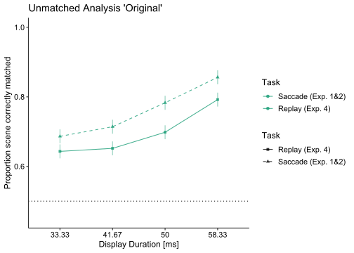<!-- --> Here we
start “replay-ISSP 1& 2 -within”: N=3 mit Faktor stim_dur_ms
(8.33-58.33, 7 levels). So who are the subjects that were tested in all
three experiments? It’s 1-3 by the definition at the top! TO DO: do the
above for unfiltered vs filtered conditions- change it for the two plots
for the thesis! Mara Comment: Here I have no p\[GG\] values; also write
it in the docs document (Final_MT)

Richard: Well, yes, apparently there are too few subjects for assumption
tests. You can state that no p\[GG\] were available and why.

``` r
# saccade experiments
common_three_sac <- issp12_prop_correct[(common_subj_id=="01" | common_subj_id=="2" | common_subj_id=="3") &
                                          stim_dur_ms < 60]
table(common_three_sac$common_subj_id, common_three_sac$stim_dur_ms)
```

    ##     
    ##      8.33 16.67 25 33.33 41.67 50 58.33
    ##   01    1     1  1     2     1  1     1
    ##   2     1     1  1     2     1  1     1
    ##   3     1     1  1     2     1  1     1

``` r
# as you can see now, people have 2 values at 33.33 - we can take the average here
common_three_sac <- common_three_sac[ , .(correct = mean(correct)),
                                      by = .(fixreplay, common_subj_id, stim_dur_ms, stim_dur_ms_f)]
table(common_three_sac$common_subj_id, common_three_sac$stim_dur_ms)
```

    ##     
    ##      8.33 16.67 25 33.33 41.67 50 58.33
    ##   01    1     1  1     1     1  1     1
    ##   2     1     1  1     1     1  1     1
    ##   3     1     1  1     1     1  1     1

``` r
# replay experiments
common_three_replay <- ISSPR_prop_correct[(common_subj_id=="01" | common_subj_id=="2" | common_subj_id=="3") &
                                            stim_dur_ms < 60 &
                                            sac_suppression_f=="unfiltered"] # choose condition here!
table(common_three_replay$common_subj_id, common_three_replay$stim_dur_ms)
```

    ##     
    ##      8.33 16.67 25 33.33 41.67 50 58.33
    ##   01    1     1  1     1     1  1     1
    ##   2     1     1  1     1     1  1     1
    ##   3     1     1  1     1     1  1     1

``` r
# combine the two sets to perform an ANOVA
common_three <- rbindlist(list(common_three_sac, common_three_replay),
                                    fill = TRUE)
table(common_three$common_subj_id, common_three$stim_dur_ms_f, common_three$fixreplay)
```

    ## , ,  = Replay (Exp. 4)
    ## 
    ##     
    ##      8.33 16.67 25 33.33 41.67 50 58.33 66.67 75
    ##   01    1     1  1     1     1  1     1     0  0
    ##   2     1     1  1     1     1  1     1     0  0
    ##   3     1     1  1     1     1  1     1     0  0
    ## 
    ## , ,  = Saccade (Exp. 1&2)
    ## 
    ##     
    ##      8.33 16.67 25 33.33 41.67 50 58.33 66.67 75
    ##   01    1     1  1     1     1  1     1     0  0
    ##   2     1     1  1     1     1  1     1     0  0
    ##   3     1     1  1     1     1  1     1     0  0

``` r
# here I make smth wrong like above (between design); ANOVA did not work
# RICHARD: experiment 1 has 3 common subjects, experiment 2 has 9. That's why it did not work. See fix above
## perform ANOVA
# use type 1 ANOVA, as we have too little subjects for assumption tests
# use ANOVA once for filtered and once for unfiltered condition for thesis!
ezANOVA(data = common_three, wid = .(common_subj_id), dv = .(correct),
        within = .(fixreplay, stim_dur_ms_f), detailed = TRUE, type = 1)
```

    ## Warning: Converting "common_subj_id" to factor for ANOVA.

    ## Warning: Converting "fixreplay" to factor for ANOVA.

    ## Warning: You have removed one or more levels from variable "stim_dur_ms_f".
    ## Refactoring for ANOVA.

    ## $ANOVA
    ##                    Effect DFn DFd         SSn          SSd          F
    ## 1               fixreplay   1   2 0.008731779 0.0004308559 40.5322498
    ## 2           stim_dur_ms_f   6  12 0.180568000 0.0368773078  9.7929058
    ## 3 fixreplay:stim_dur_ms_f   6  12 0.017022981 0.0413268781  0.8238213
    ##              p p<.05        ges
    ## 1 0.0237946637     * 0.09994388
    ## 2 0.0004868949     * 0.69662763
    ## 3 0.5727981027       0.17795664

``` r
#also take care here, if changing the condition (filtered. vs unfiltered)
ezStats(data = common_three, wid = .(common_subj_id), dv = .(correct),
        within_full = .(fixreplay, stim_dur_ms_f), within = .(fixreplay), type = 1)
```

    ## Warning: Converting "common_subj_id" to factor for ANOVA.

    ## Warning: Converting "fixreplay" to factor for ANOVA.

    ## Warning: Collapsing data to cell means first using variables supplied to
    ## "within_full", then collapsing the resulting means to means for the cells
    ## supplied to "within".

    ##            fixreplay N      Mean         SD       FLSD
    ## 1    Replay (Exp. 4) 3 0.7841048 0.04116943 0.01948914
    ## 2 Saccade (Exp. 1&2) 3 0.8129422 0.03740067 0.01948914

``` r
#ezStats(data = common_three, wid = .(common_subj_id), dv = .(correct),
        #within = .(fixreplay, stim_dur_ms_f), type = 1)

# plot to evaluate ANOVA results
ezPlot(data = common_three, wid = .(common_subj_id), dv = .(correct),
       within = .(fixreplay, stim_dur_ms_f),
       x = .(stim_dur_ms_f), split = .(fixreplay), type = 1)+scale_color_manual(values = experiment_colorscale)+ labs(y = "Proportion scene correctly matched")+
    labs(x = "Display Duration [ms]",
       color = "Task",
       linetype = "Task",
       shape = "Task")
```

    ## Warning: Converting "common_subj_id" to factor for ANOVA.

    ## Warning: Converting "fixreplay" to factor for ANOVA.

    ## Warning: You have removed one or more levels from variable "stim_dur_ms_f".
    ## Refactoring for ANOVA.

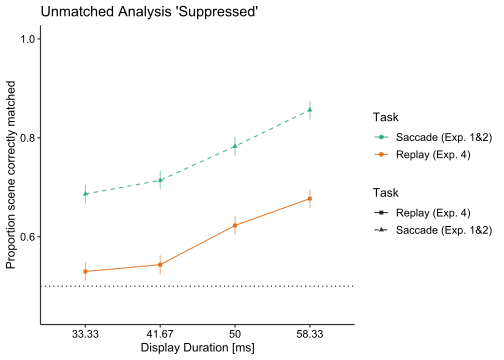<!-- --> Here I
preparing for “proportion correct” by subject (N=20)

``` r
ISSPR_data_without_overlap_metrics[ , .(prop_correct = mean(correct)),
  by = .(subj_id.x)]
```

    ##     subj_id.x prop_correct
    ##        <char>        <num>
    ##  1:        P3    0.7760381
    ##  2:        15    0.6921167
    ##  3:        19    0.6021642
    ##  4:        P2    0.7915370
    ##  5:        16    0.6138801
    ##  6:        P1    0.7554449
    ##  7:        P7    0.7402760
    ##  8:        08    0.7024266
    ##  9:        11    0.7482866
    ## 10:        12    0.6285534
    ## 11:        17    0.6178595
    ## 12:        21    0.7498440
    ## 13:        22    0.7796073
    ## 14:        P6    0.7068750
    ## 15:        13    0.6641075
    ## 16:        18    0.6264295
    ## 17:        20    0.7351828
    ## 18:        P5    0.6557060
    ## 19:        P4    0.7485893
    ## 20:        P9    0.8330097
    ##     subj_id.x prop_correct

``` r
prop_correct_subj_replay <- ISSPR_data_without_overlap_metrics[ , .(prop_correct = mean(correct)), by = .(subj_id.x, sac_suppression_f, stim_dur)][order(subj_id.x, sac_suppression_f, stim_dur)]
```

Plot for proportion correct by image condition and subject (N=20)

``` r
p_prop_correct_subj_replay <- ggplot(data = prop_correct_subj_replay,
                              aes(x = stim_dur, y = prop_correct,
                                  color = sac_suppression_f, group = sac_suppression_f)) +
  geom_point() + geom_line() + geom_hline(yintercept = 0.5,linetype='dashed')+
  theme_classic() +
  labs(x = "Presentation duration [ms]", y = "Proportion scence correctly matched",
       color = "Simulated suppression") +
  facet_wrap(~subj_id.x)

p_prop_correct_subj_replay
```

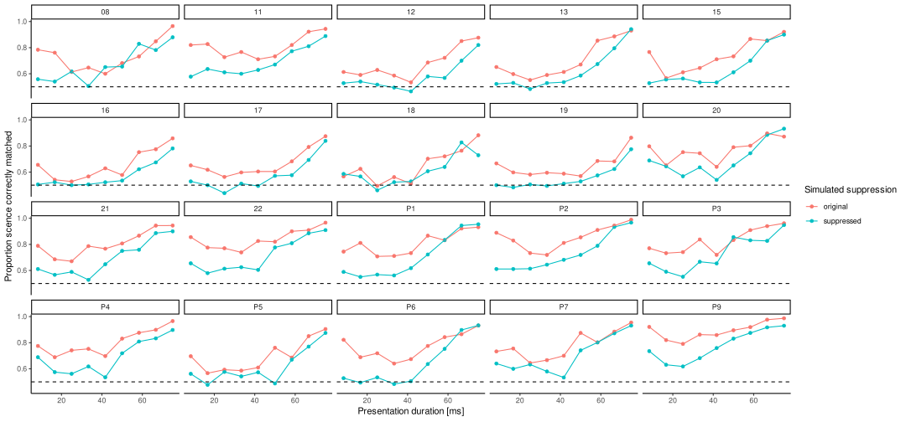<!-- -->

Here we will run the ezANOVA 1 for proportion correct

``` r
#important here (factors)
prop_correct_subj_replay$stim_dur <- factor(prop_correct_subj_replay$stim_dur)
prop_correct_subj_replay$subj_id.x <- factor(prop_correct_subj_replay$subj_id.x)

anov_prop_replay <- ezANOVA(data = prop_correct_subj_replay, dv =.(prop_correct), wid = .(subj_id.x),
                     within=.(sac_suppression_f,stim_dur),
                     detailed = TRUE)

ezStats(data = prop_correct_subj_replay, wid = .(subj_id.x), dv = .(prop_correct),
        within_full = .(sac_suppression_f, stim_dur), within = .(sac_suppression_f))
```

    ## Warning: Collapsing data to cell means first using variables supplied to
    ## "within_full", then collapsing the resulting means to means for the cells
    ## supplied to "within".

    ##   sac_suppression_f  N      Mean         SD       FLSD
    ## 1          original 20 0.7566468 0.07489012 0.01066535
    ## 2        suppressed 20 0.6606735 0.06261259 0.01066535

``` r
#ezStats(data = prop_correct_subj_replay[sac_suppression_f == "original", ],
      #  wid = .(subj_id.x), dv = .(prop_correct),
      #  within = .(stim_dur))

#ezStats(data = prop_correct_subj_replay[sac_suppression_f == "original", ],
                               #  wid = .(subj_id.x), dv = .(prop_correct),
                                 #within_full = .(stim_dur), within = .(stim_dur), type = 1)

#ezStats(data = prop_correct_subj_replay[sac_suppression_f == "suppressed", ],
      #  wid = .(subj_id.x), dv = .(prop_correct),
       # within = .(stim_dur))

anov_prop_replay
```

    ## $ANOVA
    ##                       Effect DFn DFd         SSn        SSd           F
    ## 1                (Intercept)   1  19 180.7917129 1.58503451 2167.172084
    ## 2          sac_suppression_f   1  19   0.8289774 0.04440154  354.730315
    ## 3                   stim_dur   8 152   3.8049928 0.33523020  215.657374
    ## 4 sac_suppression_f:stim_dur   8 152   0.1103492 0.29944261    7.001793
    ##              p p<.05        ges
    ## 1 4.783257e-21     * 0.98763159
    ## 2 9.460959e-14     * 0.26800979
    ## 3 6.634634e-79     * 0.62694498
    ## 4 7.591503e-08     * 0.04647343
    ## 
    ## $`Mauchly's Test for Sphericity`
    ##                       Effect          W         p p<.05
    ## 3                   stim_dur 0.11921370 0.5253277      
    ## 4 sac_suppression_f:stim_dur 0.09629587 0.3685611      
    ## 
    ## $`Sphericity Corrections`
    ##                       Effect       GGe        p[GG] p[GG]<.05       HFe
    ## 3                   stim_dur 0.6884591 4.399222e-55         * 1.0019904
    ## 4 sac_suppression_f:stim_dur 0.6696791 7.065409e-06         * 0.9634243
    ##          p[HF] p[HF]<.05
    ## 3 6.634634e-79         *
    ## 4 1.250851e-07         *

Here I start creating the plot for proportion correct and stim_dur
\[ms\]. (N=20)

``` r
#Moreys Correction for proportion correct
#Removing in-between Variance
prop_correct_subj_replay[, ID_mean := mean(prop_correct), by =.(subj_id.x)]
prop_correct_subj_replay[, overall_mean := mean(prop_correct),]
prop_correct_subj_replay[, p_mean := (prop_correct - ID_mean + overall_mean),]


p_correct_replay <- prop_correct_subj_replay[,
                               .(P_mean = mean(prop_correct), CP_mean = mean(p_mean),  C_SD = sd(p_mean),
                                 C_SE = (sd(p_mean)/sqrt(length(p_mean))), N = length(p_mean)),
                               keyby= .(sac_suppression_f, stim_dur)]


## Standardfehler und Abweichung
prop_correct_subj_replay[, prop_SE := (sd(prop_correct)/sqrt(length(prop_correct))), by =.(subj_id.x, sac_suppression_f)]
prop_correct_subj_replay[, prop_SD := sd(prop_correct), by =.(subj_id.x, sac_suppression_f)]


n_conditions <- length(unique(p_correct_replay$sac_suppression_f))*length(unique(p_correct_replay$stim_dur))
p_correct_replay[, MC_se := C_SE*(n_conditions/(n_conditions-1))]
```

Here I start creating the plot for proportion correct and
replay_sac_display_off_lat. (N=20)

``` r
prop_correct_subj_replay_latency <- ISSPR_data_without_overlap_metrics[ ,
                                                               .(prop_correct = mean(correct),
                                                                 replay_sac_display_off_latency = mean(replay_sac_display_off_latency)),
                                                               by = .(subj_id.x, sac_suppression_f, stim_dur)
                                                              ][order(subj_id.x, sac_suppression_f, stim_dur)]


#Moreys Correction for proportion correct
# Removing in-between Variance
prop_correct_subj_replay_latency[, ID_mean := mean(prop_correct), by =.(subj_id.x)]
prop_correct_subj_replay_latency[, overall_mean := mean(prop_correct),]
prop_correct_subj_replay_latency[, p_mean := (prop_correct - ID_mean + overall_mean),]

p_correct_replay_latency <- prop_correct_subj_replay_latency[,
                               .(P_mean = mean(prop_correct),
                                 CP_mean = mean(p_mean),
                                 C_SD = sd(p_mean),
                                 C_SE = (sd(p_mean)/sqrt(length(p_mean))),
                                 N = length(p_mean),
                                 replay_sac_display_off_latency = mean(replay_sac_display_off_latency)),
                               keyby = .(sac_suppression_f, stim_dur)]


## Standardfehler und Abweichung
prop_correct_subj_replay_latency[, prop_SE := (sd(prop_correct)/sqrt(length(prop_correct))), by =.(subj_id.x, sac_suppression_f)]
prop_correct_subj_replay_latency[, prop_SD := sd(prop_correct), by =.(subj_id.x, sac_suppression_f)]

n_conditions <- length(unique(p_correct_replay_latency$sac_suppression_f))*length(unique(p_correct_replay_latency$stim_dur))
p_correct_replay_latency[, MC_se := C_SE*(n_conditions/(n_conditions-1))]
```

Here is the first plot for proportion correct and
replay_display_off_latency Mara comment: Here i tried to change the
color as well (scale_color_manual(values = experiment_colorscale),
unluckly the legend changed in a wrong way; How can I solve it? Should I
change here suppressed= filtered; original= unfiltered, so that all
plots have the same legend? Iam afraid that this may be confusing due to
the other plots.

Richard: Not sure what you mean by “the legend changed in a wrong way”.
Is it the order of original/suppressed? If so, then you can use the
guide option I used below. Generally, indeed, you want to keep the color
scale, as well as the associated labels consistent across plots. You can
do that easily by updating the levels(mydata\$sac_suppression_f), see
below.

``` r
#levels(p_correct_replay_latency$sac_suppression_f) <- c("original", "suppressed") # or something else?

prop_replay_latency_plot <- ggplot(data = p_correct_replay_latency,
                           aes(x = replay_sac_display_off_latency, y = P_mean,
                               color = sac_suppression_f, group = sac_suppression_f)) +
  geom_vline(xintercept = 0, linetype = "dotted", alpha = 0.7) +  # vertikale Linie bei 0
  geom_hline(yintercept = 0.5, linetype = "dotted", alpha = 0.7) +  # horizontale Linie bei 0.5
  geom_errorbar(aes(ymax = P_mean + MC_se, ymin = P_mean - MC_se),
                width = 0, size = 1, alpha = 0.5) +  # Fehlerbalken für y
  geom_errorbarh(aes(xmax = replay_sac_display_off_latency + MC_se,
                     xmin = replay_sac_display_off_latency - MC_se),
                 height = 0, size = 1, alpha = 0.5) +  # Fehlerbalken für x
  geom_line(size = 1.5, alpha = 0.8) +  # Linie für Mittelwerte
  geom_point(size = 2.5) +  # Punkte für Mittelwerte
  theme_classic(base_size = 12.5) + ocimTheme() +  # klassisches Theme
  coord_cartesian(ylim = c(0.45, 1)) +  # Y-Achsen-Bereich anpassen
  #scale_color_viridis_d(option = "cividis", end = 0.4, direction = -1, guide = guide_legend(reverse = TRUE)) +  # Farbskala
  scale_color_manual(values = experiment_colorscale, guide = guide_legend(reverse = TRUE)) + 
  scale_y_continuous(expand = c(0,0)) +  # Y-Achse ohne zusätzliche Abstände
  scale_x_continuous(breaks = c(-50, -40, -30, -20, -10, 0, 10, 20, 30), limits = c(-50, 30)) +  # X-Achse mit entsprechenden Breaks und Limits
  labs(x = "Display offset re saccade offset [ms]", y = "Proportion scene correctly matched",
       color = "Simulated suppression", fill = "Simulated suppression") +  # Achsenbezeichner
  theme(legend.position = "right")

prop_replay_latency_plot
```

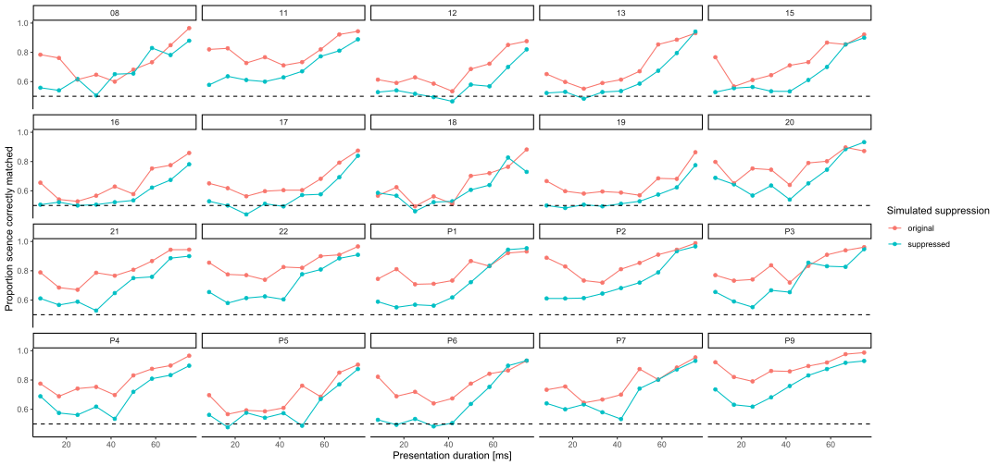<!-- -->

Here I wanna do a ezANOVA for prop_correct_subj_replay_latency

``` r
prop_correct_subj_replay_latency$stim_dur <- factor(prop_correct_subj_replay_latency$stim_dur)
prop_correct_subj_replay_latency$subj_id.x <- factor(prop_correct_subj_replay_latency$subj_id.x)

anov_prop_replay_latency <- ezANOVA(data = prop_correct_subj_replay_latency, dv = .(prop_correct),
                                    wid = .(subj_id.x), within = .(sac_suppression_f, stim_dur),
                                    detailed = TRUE)
anov_prop_replay_latency
```

    ## $ANOVA
    ##                       Effect DFn DFd         SSn        SSd           F
    ## 1                (Intercept)   1  19 180.7917129 1.58503451 2167.172084
    ## 2          sac_suppression_f   1  19   0.8289774 0.04440154  354.730315
    ## 3                   stim_dur   8 152   3.8049928 0.33523020  215.657374
    ## 4 sac_suppression_f:stim_dur   8 152   0.1103492 0.29944261    7.001793
    ##              p p<.05        ges
    ## 1 4.783257e-21     * 0.98763159
    ## 2 9.460959e-14     * 0.26800979
    ## 3 6.634634e-79     * 0.62694498
    ## 4 7.591503e-08     * 0.04647343
    ## 
    ## $`Mauchly's Test for Sphericity`
    ##                       Effect          W         p p<.05
    ## 3                   stim_dur 0.11921370 0.5253277      
    ## 4 sac_suppression_f:stim_dur 0.09629587 0.3685611      
    ## 
    ## $`Sphericity Corrections`
    ##                       Effect       GGe        p[GG] p[GG]<.05       HFe
    ## 3                   stim_dur 0.6884591 4.399222e-55         * 1.0019904
    ## 4 sac_suppression_f:stim_dur 0.6696791 7.065409e-06         * 0.9634243
    ##          p[HF] p[HF]<.05
    ## 3 6.634634e-79         *
    ## 4 1.250851e-07         *

Control analyses of saccade metrics (saccade duration, peak velocity,
amplitude)

``` r
ISSP_mean_sac_subj <- issp[experiment_f %in% c(1, 2), .(sac_dur = mean(sac_dur),
                                                         sac_amp = mean(sac_amp),
                                                         sac_vpeak = mean(vpeak),
                                                         sac_display_off_latency = mean(sac_display_off_latency),
                                                         sac_display_latency = mean(sac_display_latency) ),
                            by = .(experiment_f, subj_id, stim_dur_ms_f)]


# correction for between-subject variance
ISSP_mean_sac_subj[ , gm_sac_dur := mean(sac_dur), by = .(experiment_f)]
ISSP_mean_sac_subj[ , gm_sac_amp := mean(sac_amp), by = .(experiment_f)]
ISSP_mean_sac_subj[ , gm_sac_vpeak := mean(sac_vpeak), by = .(experiment_f)]
ISSP_mean_sac_subj[ , sac_dur.w := sac_dur - mean(sac_dur) + gm_sac_dur, by = .(subj_id, experiment_f)]
ISSP_mean_sac_subj[ , sac_amp.w := sac_amp - mean(sac_amp) + gm_sac_amp, by = .(subj_id, experiment_f)]
ISSP_mean_sac_subj[ , sac_vpeak.w := sac_vpeak - mean(sac_vpeak) + gm_sac_vpeak, by = .(subj_id, experiment_f)]


# aggregate to subject level
ISSP_mean_sac <- ISSP_mean_sac_subj[ , .(sac_dur = mean(sac_dur),
                                         sac_dur_sd = sd(sac_dur.w) / sqrt(length(sac_dur)),
                                         sac_amp = mean(sac_amp),
                                         sac_amp_sd = sd(sac_amp.w) / sqrt(length(sac_amp)),
                                         sac_vpeak = mean(sac_vpeak),
                                         sac_vpeak_sd = sd(sac_vpeak.w) / sqrt(length(sac_vpeak)),
                                         sac_display_off_latency = mean(sac_display_off_latency),
                                         sac_display_off_latency_sd = sd(sac_display_off_latency) / sqrt(length(sac_display_off_latency))),
                                       by = .(experiment_f, stim_dur_ms_f)]
```

Here is the Plot for Saccade duration and Exp 1&2

``` r
dur_xlim_sacmetrics <- c(-60, 30)
p_sac_dur <- ggplot(data = ISSP_mean_sac,
                    aes(x = sac_display_off_latency, y = sac_dur, color = experiment_f)) +
  geom_vline(xintercept = 0, linetype = "dotted", alpha = 0.7) +
  geom_line(data = ISSP_mean_sac_subj,
            aes(x = sac_display_off_latency, y = sac_dur.w, color = experiment_f, group = paste(experiment_f, subj_id)),
            size = 0.5, alpha = 0.2) +
  geom_errorbar(aes(ymax = sac_dur + 2*sac_dur_sd, ymin = sac_dur - 2*sac_dur_sd),
                width = 0, size = 1, alpha = 0.5) +
  geom_errorbarh(aes(xmax = sac_display_off_latency + 2*sac_display_off_latency_sd,
                     xmin = sac_display_off_latency - 2*sac_display_off_latency_sd),
                 height = 0, size = 1, alpha = 0.5) +
  geom_point(size = 1.5) +
  geom_line(size = 1.5) +
  coord_cartesian(expand = FALSE, xlim = dur_xlim_sacmetrics) +
  scale_color_manual(values = experiment_colorscale) +
  scale_fill_manual(values = experiment_colorscale) +
  scale_alpha_manual(values = seq(0.2, 1, length.out = 8)) +
  labs(x = "Display offset re saccade offset [ms]", y = "Saccade\nduration [ms]",
       color = "Experiment", fill = "Experiment") +
  theme_minimal(base_size = 15) + ocimTheme()

p_sac_dur
```

<!-- -->

``` r
ezStats(data = ISSP_mean_sac_subj[experiment_f=="1"],
        dv = .(sac_dur), wid = .(subj_id),
        within = .(stim_dur_ms_f) )
```

    ## Warning: You have removed one or more Ss from the analysis. Refactoring
    ## "subj_id" for ANOVA.

    ## Warning: You have removed one or more levels from variable "stim_dur_ms_f".
    ## Refactoring for ANOVA.

    ##   stim_dur_ms_f  N     Mean       SD     FLSD
    ## 1          8.33 20 59.83659 6.266814 1.587241
    ## 2         16.67 20 62.07957 7.628768 1.587241
    ## 3            25 20 64.09421 8.744297 1.587241
    ## 4         33.33 20 63.95832 9.770770 1.587241

``` r
ezStats(data = ISSP_mean_sac_subj[experiment_f=="2"],
        dv = .(sac_dur), wid = .(subj_id),
        within = .(stim_dur_ms_f) )
```

    ## Warning: You have removed one or more Ss from the analysis. Refactoring
    ## "subj_id" for ANOVA.
    ## Warning: You have removed one or more levels from variable "stim_dur_ms_f".
    ## Refactoring for ANOVA.

    ##   stim_dur_ms_f  N     Mean       SD      FLSD
    ## 1         33.33 20 61.35510 9.047236 0.5779605
    ## 2         41.67 20 61.45564 8.980591 0.5779605
    ## 3            50 20 61.46610 9.079075 0.5779605
    ## 4         58.33 20 61.42502 8.983800 0.5779605

Here is the plot for Saccade Velocity and Exp 1&2

``` r
peak_xlim_sacmetrics <- c(-60, 30)
p_sac_vpeak <- ggplot(data = ISSP_mean_sac,
                    aes(x = sac_display_off_latency, y = sac_vpeak, color = experiment_f)) +
  geom_vline(xintercept = 0, linetype = "dotted", alpha = 0.7) +
  geom_line(data = ISSP_mean_sac_subj,
            aes(x = sac_display_off_latency, y = sac_vpeak.w, color = experiment_f, group = paste(experiment_f, subj_id)),
            size = 0.5, alpha = 0.2) +
  geom_errorbar(aes(ymax = sac_vpeak + 2*sac_vpeak_sd, ymin = sac_vpeak - 2*sac_vpeak_sd),
                width = 0, size = 1, alpha = 0.5) +
  geom_errorbarh(aes(xmax = sac_display_off_latency + 2*sac_display_off_latency_sd,
                     xmin = sac_display_off_latency - 2*sac_display_off_latency_sd),
                 height = 0, size = 1, alpha = 0.5) +
  geom_point(size = 1.5) +
  geom_line(size = 1.5) +
  coord_cartesian(expand = FALSE, xlim = peak_xlim_sacmetrics) +
  scale_color_manual(values = experiment_colorscale) +
  scale_fill_manual(values = experiment_colorscale) +
  scale_alpha_manual(values = seq(0.2, 1, length.out = 8)) +
  labs(x = "Display offset re saccade offset [ms]", y = "Saccade peak\nvelocity [dva/s]",
       color = "Experiment", fill = "Experiment") +
  theme_minimal(base_size = 15) + ocimTheme()
p_sac_vpeak
```

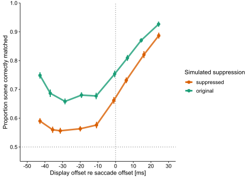<!-- -->

``` r
ezStats(data = ISSP_mean_sac_subj[experiment_f=="1"],
        dv = .(sac_vpeak), wid = .(subj_id),
        within = .(stim_dur_ms_f) )
```

    ## Warning: You have removed one or more Ss from the analysis. Refactoring
    ## "subj_id" for ANOVA.

    ## Warning: You have removed one or more levels from variable "stim_dur_ms_f".
    ## Refactoring for ANOVA.

    ##   stim_dur_ms_f  N     Mean       SD     FLSD
    ## 1          8.33 20 409.1819 85.91431 3.670927
    ## 2         16.67 20 412.9048 85.77601 3.670927
    ## 3            25 20 413.3061 82.54489 3.670927
    ## 4         33.33 20 410.7231 85.69411 3.670927

``` r
ezStats(data = ISSP_mean_sac_subj[experiment_f=="2"],
        dv = .(sac_vpeak), wid = .(subj_id),
        within = .(stim_dur_ms_f) )
```

    ## Warning: You have removed one or more Ss from the analysis. Refactoring
    ## "subj_id" for ANOVA.
    ## Warning: You have removed one or more levels from variable "stim_dur_ms_f".
    ## Refactoring for ANOVA.

    ##   stim_dur_ms_f  N     Mean       SD   FLSD
    ## 1         33.33 20 432.2431 74.98052 2.4316
    ## 2         41.67 20 430.2842 74.42426 2.4316
    ## 3            50 20 431.9379 75.67693 2.4316
    ## 4         58.33 20 432.0372 74.08711 2.4316

Here is the Plot für Saccade Amplitude and Exp 1&2

``` r
amp_xlim_sacmetrics <- c(-60, 30)
p_sac_amp <- ggplot(data = ISSP_mean_sac,
                    aes(x = sac_display_off_latency, y = sac_amp, color = experiment_f)) +
  geom_vline(xintercept = 0, linetype = "dotted", alpha = 0.7) +
  geom_line(data = ISSP_mean_sac_subj,
            aes(x = sac_display_off_latency, y = sac_amp.w, color = experiment_f, group = paste(experiment_f, subj_id)),
            size = 0.5, alpha = 0.2) +
  geom_errorbar(aes(ymax = sac_amp + 2*sac_amp_sd, ymin = sac_amp - 2*sac_amp_sd),
                width = 0, size = 1, alpha = 0.5) +
  geom_errorbarh(aes(xmax = sac_display_off_latency + 2*sac_display_off_latency_sd,
                     xmin = sac_display_off_latency - 2*sac_display_off_latency_sd),
                 height = 0, size = 1, alpha = 0.5) +
  geom_point(size = 1.5) +
  geom_line(size = 1.5) +
  coord_cartesian(expand = FALSE, xlim = amp_xlim_sacmetrics) +
  scale_color_manual(values = experiment_colorscale) +
  scale_fill_manual(values = experiment_colorscale) +
  scale_alpha_manual(values = seq(0.2, 1, length.out = 8)) +
  labs(x = "Display offset re saccade offset [ms]", y = "Saccade\namplitude [dva]",
       color = "Experiment", fill = "Experiment") +
  theme_minimal(base_size = 15) + ocimTheme()
p_sac_amp
```

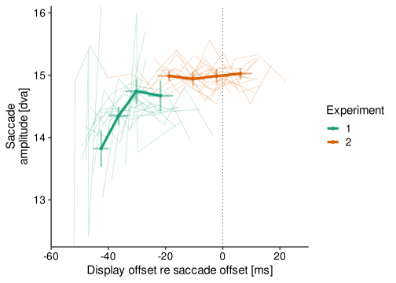<!-- -->

``` r
ezStats(data = ISSP_mean_sac_subj[experiment_f=="1"],
        dv = .(sac_amp), wid = .(subj_id),
        within = .(stim_dur_ms_f) )
```

    ## Warning: You have removed one or more Ss from the analysis. Refactoring
    ## "subj_id" for ANOVA.

    ## Warning: You have removed one or more levels from variable "stim_dur_ms_f".
    ## Refactoring for ANOVA.

    ##   stim_dur_ms_f  N     Mean       SD      FLSD
    ## 1          8.33 20 13.82307 1.987747 0.3708322
    ## 2         16.67 20 14.34741 1.918351 0.3708322
    ## 3            25 20 14.74221 1.654490 0.3708322
    ## 4         33.33 20 14.67050 2.108934 0.3708322

``` r
ezStats(data = ISSP_mean_sac_subj[experiment_f=="2"],
        dv = .(sac_amp), wid = .(subj_id),
        within = .(stim_dur_ms_f) )
```

    ## Warning: You have removed one or more Ss from the analysis. Refactoring
    ## "subj_id" for ANOVA.
    ## Warning: You have removed one or more levels from variable "stim_dur_ms_f".
    ## Refactoring for ANOVA.

    ##   stim_dur_ms_f  N     Mean       SD      FLSD
    ## 1         33.33 20 14.98784 1.978566 0.1651904
    ## 2         41.67 20 14.94116 1.996627 0.1651904
    ## 3            50 20 14.98566 2.128733 0.1651904
    ## 4         58.33 20 15.02627 2.105992 0.1651904

Here I wanna do the histogramm for number of trials and display duration
for Exp. 1&2

``` r
histo_xlim_pres <- c(-70, 60)

# first, present the metric display offset re saccade offset
p_histo12 <- ggplot(data = issp %>% filter(experiment %in% c(1, 2)), aes(x = sac_display_off_latency,
                                               color = experiment_f, group = paste(stim_dur_ms_f, experiment_f),
                                               alpha = stim_dur_ms_f)) +
  geom_hline(aes(color = experiment_f, yintercept = 0), size = 2) +
  geom_vline(xintercept = 0, linetype = "dotted", alpha = 0.7) +
  geom_freqpoly(binwidth = 4, size = 1.5) +
  #geom_density(size = 1.5) +
  coord_cartesian(expand = FALSE, xlim = histo_xlim_pres ) +
  scale_color_manual(values = experiment_colorscale) +
  scale_fill_manual(values = experiment_colorscale) +
  scale_alpha_manual(values = seq(0.2, 1, length.out = 8)) +
  labs(x = "Display offset re saccade offset [ms]", y = "Number of trials",
       color = "Experiment", fill = "Experiment", alpha = "Display\nduration [ms]") +
  theme_minimal(base_size = 15) + ocimTheme() +
  facet_wrap(~experiment_f, nrow = 3, scales = "free_y", strip.position = "right") + guides(color = "none")
p_histo12
```

<!-- -->

Here I wanna do the frequency plot for the mean distribution of all
samples and observers for replay no vari. times for all observers, no
individual saccade statistics Mara Comment: False color scale and false
plot (did I use the false data)?

Richard: Well, yes, you use the wrong data, that is, the aggregated data
(one point per condition). To compute proper histograms, you’d need the
trial-resolved data. I’m not sure what you ultimately what to plot but I
guess you want to replicate the plot above? I have only changed the
basic, this plot still needs work (color scale, labels, theme etc).

Again: the color scale in the plot above is the same you use to compare
original vs suppressed. Make sure this can be visually disentangled.
Also, the plot is basically the one from the manuscript and I’m not sure
whether that’s a good idea with Martin and Sven as your referees.

``` r
plot_freq <- ggplot(data = ISSPR_data_without_overlap_metrics,
                    aes(x = replay_sac_display_off_latency,
                        color = factor(experiment), group = paste(stim_dur_ms_f, experiment),
                                               alpha = stim_dur_ms_f)) +
  geom_hline(aes(color = factor(experiment), yintercept = 0), size = 2) +
  geom_vline(xintercept = 0, linetype = "dotted", alpha = 0.7) +
  geom_freqpoly(binwidth = 4, size = 1.5) +
  coord_cartesian(expand = FALSE, xlim = c(-70, 60)) +
  scale_color_manual(values = experiment_colorscale,  labels = c("4" = "Replay"))+
  scale_fill_manual(values = experiment_colorscale,  labels = c("4" = "Replay")) +
  labs(x = "Display offset re saccade offset [ms]", y = "Frequency",
       fill = "Observers", color = "Observers") +
  theme_minimal(base_size = 15)

plot_freq
```

<!-- -->

Here I wanna make predictions of saccade data related to replay
(within-subject); how strong are the datapoints related to each other?

Mara Comment: Need help here pls

Richard: Sorry, not sure I understand. You want to correlate proportion
correct in the saccade exp and proportion correct in the replay exp,
matched by condition? I guess I could write this code for you (which is
not the goal), but as this is exploratory and you still have other stuff
to do, I’d suggest we postpone this and work on this together if you
still have time.

``` r
# 
# lmer(replay_sac_display_off_latency ~ sac_display_off_latency + (1 | common_subj_id), data = subset_ISSPexperiments)
# 
# #other option Pearson correlation
# pearson_ISSPR <- cor.test(subset_ISSPexperiments$sac_display_off_latency,
#                              subset_ISSPexperiments$replay_sac_display_off_latency,
#                              method = "pearson")
# pearson_ISSPR
# 
# #repeated measures Korrelation
# #library(rmcorr)
# #rmcorr_ISSPR <- rmcorr(participant = common_subj_id,
#                        # measure1 = sac_display_off_latency,
#                        # measure2 = replay_sac_display_off_latency,
#                        # data = subset_ISSPexperiments)
# 
# rmcorr_ISSPR
```

Here this is not needed for the master thesis Here we will create BINS
for the latency

``` r
ISSPR_data_without_overlap_metrics[, sac_display_off_latency_bins := cut_number(replay_sac_display_off_latency, n=4)]


prop_correct_subj_bins_replay <- ISSPR_data_without_overlap_metrics[ , .(prop_correct = mean(correct)),
                                by = .(subj_id.x, sac_suppression_f, sac_display_off_latency_bins)][order(subj_id.x, sac_suppression_f, sac_display_off_latency_bins)]


prop_correct_subj_bins_replay$sac_suppression_f <- ordered(prop_correct_subj_bins_replay$sac_suppression_f)
```

Here we will create the Plot for BINS

``` r
p_prop_correct_subj_bins_replay <- ggplot(data = prop_correct_subj_bins_replay,
                                   aes(x = sac_display_off_latency_bins, y = prop_correct,
                                       color = sac_suppression_f, group = sac_suppression_f)) +
  geom_point() + geom_line() +
  theme_classic() +
  labs(x = "Display offset re simulated saccade offset", y = "Proportion correct",
       color = "Simulated suppression") +
  facet_wrap(~subj_id.x)

p_prop_correct_subj_bins_replay
```

<!-- --> Here we
will have the ezANOVA 2 for the BINS

``` r
prop_correct_subj_bins_replay$subj_id.x <- factor(prop_correct_subj_bins_replay$subj_id.x)
anov_prop_bins_replay <- ezANOVA(data = prop_correct_subj_bins_replay, dv =prop_correct, wid = subj_id.x,
                          within=.(sac_suppression_f,sac_display_off_latency_bins),
                          detailed = TRUE)

anov_prop_bins_replay
```

    ## $ANOVA
    ##                                           Effect DFn DFd         SSn        SSd
    ## 1                                    (Intercept)   1  19 80.40031463 0.69189558
    ## 2                              sac_suppression_f   1  19  0.38384850 0.02036182
    ## 3                   sac_display_off_latency_bins   3  57  1.84188337 0.06507936
    ## 4 sac_suppression_f:sac_display_off_latency_bins   3  57  0.02590492 0.07715523
    ##             F            p p<.05        ges
    ## 1 2207.856246 4.014374e-21     * 0.98948380
    ## 2  358.176257 8.669066e-14     * 0.30997008
    ## 3  537.740175 9.367536e-42     * 0.68309606
    ## 4    6.379263 8.375004e-04     * 0.02942414
    ## 
    ## $`Mauchly's Test for Sphericity`
    ##                                           Effect         W          p p<.05
    ## 3                   sac_display_off_latency_bins 0.4355546 0.01172588     *
    ## 4 sac_suppression_f:sac_display_off_latency_bins 0.6784405 0.23075778      
    ## 
    ## $`Sphericity Corrections`
    ##                                           Effect       GGe        p[GG]
    ## 3                   sac_display_off_latency_bins 0.6716641 8.539675e-29
    ## 4 sac_suppression_f:sac_display_off_latency_bins 0.8348422 1.829541e-03
    ##   p[GG]<.05       HFe        p[HF] p[HF]<.05
    ## 3         * 0.7516402 5.918100e-32         *
    ## 4         * 0.9717925 9.566222e-04         *

Morey Korrektur incl Cousineau for BINS

``` r
prop_correct_subj_bins_replay[, ID_mean := mean(prop_correct), by =.(subj_id.x)]
prop_correct_subj_bins_replay[, overall_mean := mean(prop_correct),]
prop_correct_subj_bins_replay[, p_mean := (prop_correct - ID_mean + overall_mean),]

p_correct_bins_replay <- prop_correct_subj_bins_replay[,
                                         .(P_mean = mean(prop_correct), CP_mean = mean(p_mean),  C_SD = sd(p_mean),
                                           C_SE = (sd(p_mean)/sqrt(length(p_mean))), N = length(p_mean)),
                                         keyby= .(sac_suppression_f, sac_display_off_latency_bins)]


# SD und Abweichung
prop_correct_subj_bins_replay[, prop_SE := (sd(prop_correct)/sqrt(length(prop_correct))), by =.(subj_id.x, sac_suppression_f)]
prop_correct_subj_bins_replay[, prop_SD := sd(prop_correct), by =.(subj_id.x, sac_suppression_f)]


n_conditions_bins <- length(unique(p_correct_bins_replay$sac_suppression_f))*length(unique(p_correct_bins_replay$sac_display_off_latency_bins))
p_correct_bins_replay[, MC_se := C_SE*(n_conditions_bins/(n_conditions_bins-1))]
```

Second Plot for BINS

``` r
prop_bins_replay <- ggplot(data = p_correct_bins_replay,
                 aes(x = sac_display_off_latency_bins,
                     y = P_mean,
                     color = sac_suppression_f, fill = sac_suppression_f, group = sac_suppression_f)) +

  geom_hline(yintercept = 0.5,linetype='dashed')+
  geom_line(size = 1.5, alpha = 0.8) +
  geom_point(alpha = 0.8, size = 3) +
  geom_ribbon(aes(ymin = P_mean - MC_se,
                  ymax = P_mean + MC_se), color = NA, alpha = 0.3) +
  scale_y_continuous(expand=c(0,0),limits=c(0.45,1))+
  scale_fill_viridis_d(option = "cividis", end = 0.4, direction = -1, guide = guide_legend(reverse = TRUE)) +
  scale_color_viridis_d(option = "cividis", end = 0.4, direction = -1, guide = guide_legend(reverse = TRUE)) +
  theme_classic(base_size = 15) + ocimTheme() +
  labs(x = "Display offset re simulated saccade offset",y = "Proportion correct",
       fill = "Image type", color = "Image type") +
  theme(legend.position = "right")

prop_bins_replay
```

<!-- --> Here we
will run some other des. statistics

``` r
ezStats(data = ISSPR_data_without_overlap_metrics[experiment=="4"],
        dv = .(replay_sac_display_latency), wid = .(subj_id.x),
        within = .(stim_dur) )
```

    ## Warning: Converting "subj_id.x" to factor for ANOVA.

    ## Warning: "stim_dur" will be treated as numeric.

    ## Warning: Collapsing data to cell means. *IF* the requested effects are a subset
    ## of the full design, you must use the "within_full" argument, else results may
    ## be inaccurate.

    ## Warning: There is at least one numeric within variable, therefore aov() will be
    ## used for computation and no assumption checks will be obtained.

    ##    stim_dur  N     Mean        SD      FLSD
    ## 1  8.333333 20 8.845138 0.1726913 0.1233542
    ## 2 16.666667 20 8.937816 0.1397880 0.1233542
    ## 3 25.000000 20 8.869960 0.1663857 0.1233542
    ## 4 33.333333 20 9.060644 0.2405516 0.1233542
    ## 5 41.666667 20 9.321213 0.2206385 0.1233542
    ## 6 50.000000 20 9.310555 0.1593640 0.1233542
    ## 7 58.333333 20 9.252517 0.2083374 0.1233542
    ## 8 66.666667 20 9.197438 0.2020838 0.1233542
    ## 9 75.000000 20 9.277307 0.1485654 0.1233542

``` r
ezStats(data = ISSPR_data_without_overlap_metrics[experiment=="4"],
        dv = .(replay_sac_dur), wid = .(subj_id.x),
        within = .(stim_dur) )
```

    ## Warning: Converting "subj_id.x" to factor for ANOVA.

    ## Warning: "stim_dur" will be treated as numeric.

    ## Warning: Collapsing data to cell means. *IF* the requested effects are a subset
    ## of the full design, you must use the "within_full" argument, else results may
    ## be inaccurate.

    ## Warning: There is at least one numeric within variable, therefore aov() will be
    ## used for computation and no assumption checks will be obtained.

    ##    stim_dur  N     Mean        SD      FLSD
    ## 1  8.333333 20 59.94793 0.8543478 0.7995613
    ## 2 16.666667 20 61.90245 0.7700641 0.7995613
    ## 3 25.000000 20 63.83004 1.2932527 0.7995613
    ## 4 33.333333 20 62.03077 1.0490223 0.7995613
    ## 5 41.666667 20 61.88801 0.7538052 0.7995613
    ## 6 50.000000 20 60.07350 1.2177499 0.7995613
    ## 7 58.333333 20 61.18590 1.0949111 0.7995613
    ## 8 66.666667 20 60.58549 1.0407147 0.7995613
    ## 9 75.000000 20 59.89003 1.0427160 0.7995613

``` r
anov_replay_sac_dur <- ezANOVA(data = ISSPR_data_without_overlap_metrics[experiment=="4"],
        dv = .(replay_sac_dur), wid = .(subj_id.x),
        within = .(stim_dur), detailed = TRUE)
```

    ## Warning: Converting "subj_id.x" to factor for ANOVA.

    ## Warning: "stim_dur" will be treated as numeric.

    ## Warning: Collapsing data to cell means. *IF* the requested effects are a subset
    ## of the full design, you must use the "within_full" argument, else results may
    ## be inaccurate.

    ## Warning: There is at least one numeric within variable, therefore aov() will be
    ## used for computation and no assumption checks will be obtained.

Here we will figure out the effect of suppression and the task

``` r
ISSPR_suppression_correct <- ISSPR_data_without_overlap_metrics[ , .(prop_correct = mean(correct),
                                               replay_sac_display_off_latency = mean(replay_sac_display_off_latency)),
                            by = .(subj_id.x, sac_suppression_f, stim_dur)]


ISSPR_suppression_correct [ , stim_dur := ordered(stim_dur)]

#Morey Korrektur incl Cousineau für suppression and task
ISSPR_suppression_correct[, ID_mean := mean(prop_correct), by =.(subj_id.x)]
ISSPR_suppression_correct[, overall_mean := mean(prop_correct),]
ISSPR_suppression_correct[, p_mean := (prop_correct - ID_mean + overall_mean),]

p_correct_suppression <- ISSPR_suppression_correct[,
                                                       .(P_mean = mean(prop_correct), CP_mean = mean(p_mean),  C_SD = sd(p_mean),
                                                         C_SE = (sd(p_mean)/sqrt(length(p_mean))), N = length(p_mean)),
                                                       keyby= .(sac_suppression_f, replay_sac_display_off_latency)]


# SD und Abweichung
ISSPR_suppression_correct[, prop_SE := (sd(prop_correct)/sqrt(length(prop_correct))), by =.(subj_id.x, sac_suppression_f)]
ISSPR_suppression_correct[, prop_SD := sd(prop_correct), by =.(subj_id.x, sac_suppression_f)]


n_conditions_supp <- length(unique(p_correct_suppression$sac_suppression_f))*length(unique(p_correct_suppression$replay_sac_display_off_latency))
p_correct_suppression[, MC_se := C_SE*(n_conditions_supp/(n_conditions_supp-1))]
```

Here we will have two dimensions (saccade duration and saccade
amplitude) for each subject by mean

``` r
ISSPR_data_without_overlap_metrics[, sac_amp_n := cut_number(sac_amp, n=10)]
ISSPR_data_without_overlap_metrics[, sac_dur_bins := cut_number(sac_dur, n=2)]
table(ISSPR_data_without_overlap_metrics$subj_id.x,
      ISSPR_data_without_overlap_metrics$sac_dur_bins)
```

    ##     
    ##      [22,60] (60,102]
    ##   08     792      774
    ##   11     809      796
    ##   12     800      783
    ##   13     789      774
    ##   15     790      821
    ##   16     793      792
    ##   17     775      748
    ##   18     797      777
    ##   19     792      779
    ##   20     803      783
    ##   21     845      758
    ##   22     808      771
    ##   P1     833      774
    ##   P2     815      792
    ##   P3     726      743
    ##   P4     837      758
    ##   P5     785      766
    ##   P6     815      785
    ##   P7     821      773
    ##   P9     773      772

``` r
metrics_subj_bins_replay_dur <- ISSPR_data_without_overlap_metrics[ , .(sac_dur_f = mean(sac_dur),
                                                                        disp_off_re_sac_off = mean(replay_sac_display_off_latency),
                                                                        correct = mean(correct)),
                                                                by = .(subj_id.x, sac_dur_bins, stim_dur)]
metrics_subj_bins_replay_dur[ , sac_dur_f2 := mean(sac_dur_f), by = .(subj_id.x, sac_dur_bins)]
```

Here is the plot of sac_dur and sac_amp

``` r
ggplot(data = metrics_subj_bins_replay_dur,
       aes(x = disp_off_re_sac_off,
           #x = as.numeric(stim_dur),
           y = correct,
           color = sac_dur_f, group = sac_dur_f2 )) +
  geom_hline(yintercept = 0.5, linetype = "dotted") +
  geom_vline(xintercept = 0, linetype = "dotted") +
  geom_point() + geom_line() +
  theme_classic() +
  labs(x = "Display offset re saccade offset", y = "Proportion correct",
       color = "Sacc. duration") +
  facet_wrap(~subj_id.x)
```

<!-- -->
